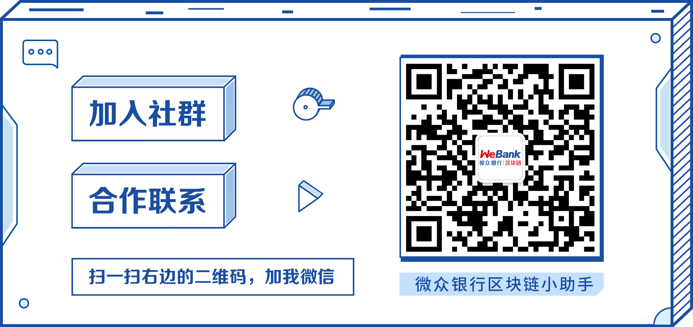
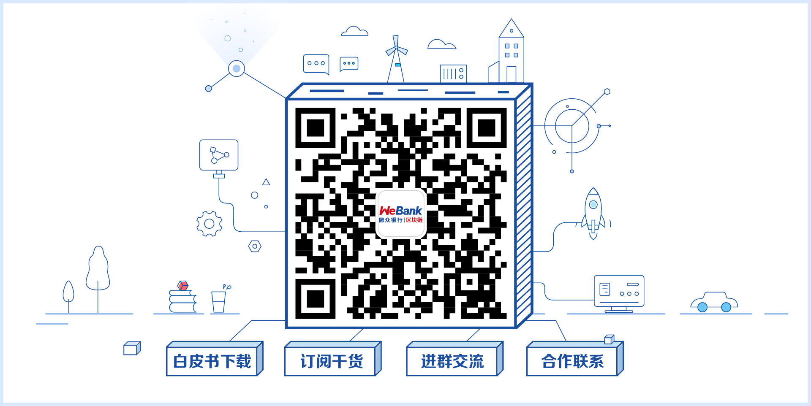
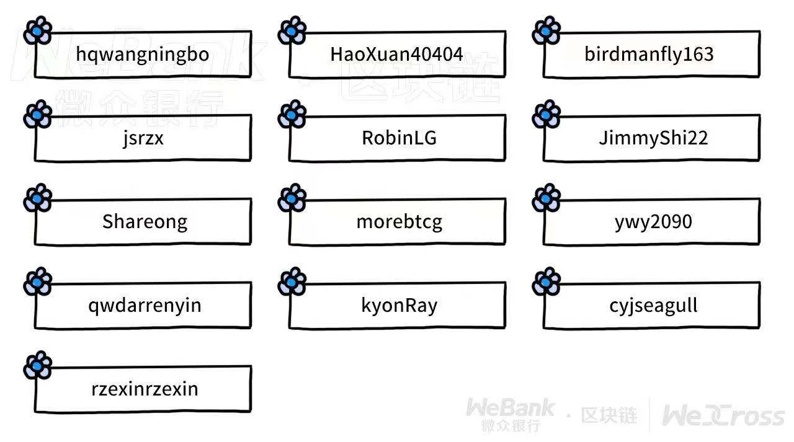

# WeCross社区

如果你有志于成为跨链协作基础设施建造者，欢迎加入WeCross社区！

你的每一个Issue，每一次PR，每一行代码，每一回“吐槽”，都是WeCross大步向前的铿锵印记。

## 社区资源

社区是促进WeCross稳步发展的关键支撑，是推进WeCross研发进程的中坚力量，也是汇聚了所有开发者集体智慧的大本营。WeCross的开发、维护、运营都由社区协作完成。

社区资源来自开发者，用于开发者，如果你遇到问题，这些资源可以带你快速找到答案。社区也欢迎你在解决问题之后，将经验化成资源回馈社区，以飨更多开发者。

- 交流群：如在实操方面遇到阻碍或想和开发者们随时随地交流，那么加群、加群、加群，群里的“老司机”很乐意为你提供解答和支持。

- 公众号：及时掌握项目动态、了解版本更新信息、阅读来自社区的精彩文章，以及查阅近期活动安排。

- 社区活动：社区不定期举办各类型交流活动，你可以来[Meetup](https://mp.weixin.qq.com/s/X91tRrYudrFUVavig4koaQ)上和社区开发者深度讨论技术，极速提高技术能力；可以花36小时在Hackathon赛场上和开发者们进行代码的创意角逐，收获一份“秃然”的革命友谊；可以参加WeCross社区例会，为开发进程建言献策，并找到合适的切入点，一起参与WeCross项目的建设。

## 社区治理

**每一次陪伴都值得感激**。社区感谢每一位见证WeCross成长的开发者和用户，并为每一个贡献者提供专属的纪念品(神秘.JPG)。同时，参与[社区活动](./event.html)也有机会获得礼品等福利。

>目前，我们在[WeCross Issues](https://github.com/WeBankBlockchain/WeCross/issues)中设置了低难度（Task-L）和中难度（Task-M）两个梯度的Task，其中标注为help wanted的Issue均为可认领Task。
>
>完成代码，提交PR并合入后，将根据任务难度等级获得积分，累计一定数量积分可换取神秘纪念品！详情请关注：[社区活动](./event.html#Task挑战)

**每一份付出都值得铭记**。社区公开维护一个贡献榜记录曾参与和帮助WeCross建设的社区贡献者。榜单见证了每一位贡献者成长的轨迹，也留下了WeCross不断迭代发展的烙印。

>WeCross的开发、维护、运营都由社区协作完成，感谢在各个版本开发过程中积极参与和贡献的每一位小伙伴。
>
>

**每一个约定都值得坚守**。为了让用户的诉求得到清晰而充分地表达，为了让开发者更高效便捷地参与WeCross建设，社区协作制定了[PR规范](./contributor.html#PR规范)，[代码规范](./contributor.html#代码规范)，[测试规范](./contributor.html#测试规范)，[改进提案(CIP)规范](./cip.html)等社区规约，欢迎大家一起遵守和完善。

正如WeCross[白皮书](https://mp.weixin.qq.com/s/w0APEAonFXbOoinMJipPAA)所言，“风起于青萍之末，一场围绕区块链技术的变革正在徐徐拉开帷幕。与一个具备无限潜力的趋势共同成长，现在，正是最好的时节”。期待更多开发者和WeCross社区并肩同行！

## 参与社区

- 报告错误和功能请求：如你发现错误、发现不合理的地方需要优化，或想提出功能请求，可以提交[Issue](https://github.com/WeBankBlockchain/WeCross/issues)，如果是小问题修复，欢迎顺手提个[PR](https://github.com/WeBankBlockchain/WeCross/pulls)。

- 领取可以完成的任务：社区在Issue中提供了一些容易上手的任务，标记为`help wanted`标签，你可以从中领取合适的任务，尝试完成开发，并按照[贡献代码指引](./contributor.html)提交代码。

- 提交改进提案CIP：如果社区的任务你已经游刃有余，那么做点有挑战的事吧！你可以从WeCross设计的层面提出思考，然后在Issue中提一个改进提案[CIP](./cip.html)，和社区开发者分享、讨论你的提案，并在社区统一共识后，一起完成开发。

- 分享开发心得：他山之石可以攻玉，经过充分沉淀的你可以写文章，分享任何你觉得有助于其他开发者的经验和知识，文章会署名发表在微众银行区块链公众号。
