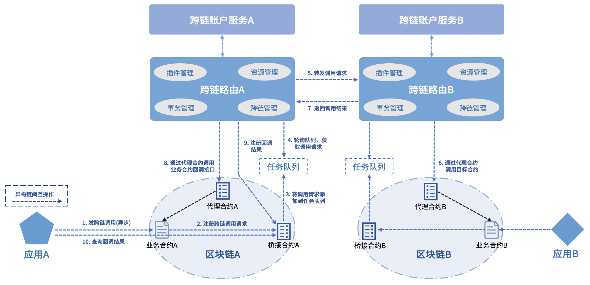

# 合约跨链调用(Hub)

WeCross支持由合约发起跨链调用，即可在源链的智能合约中发起对其它链资源的调用。

## 原理解析

WeCross提供了两个系统合约，分别是代理合约和桥接合约。代理合约是WeCross调用链上其它合约的统一入口，桥接合约则负责保存链上的跨链调用请求。跨链路由通过轮询桥接合约的任务队列，获取跨链调用请求，然后完成请求的转发和处理。

合约跨链调用具体流程如下：

1. 源链的业务合约调用源链的桥接合约，注册跨链请求以及回调接口

2. 源链的跨链路由轮询源链的桥接合约，获取跨链请求

3. 源链的跨链路由解析跨链请求，完成对目标链的调用

4. 源链的跨链路由将目标链返回的结果作为参数，调用源链的回调接口

5. 源链的跨链路由将回调接口的调用结果注册到源链的桥接合约




## 桥接合约

WeCross提供了[Solidity版本](https://github.com/WeBankBlockchain/WeCross-BCOS2-Stub/blob/master/src/main/resources/WeCrossHub.sol)和[Golang版本](https://github.com/WeBankBlockchain/WeCross-Fabric1-Stub/blob/dev/src/main/resources/chaincode/WeCrossHub/hub.go)的桥接合约。

- Solidity版本

``` solidity
/** 供业务合约调用，注册跨链调用请求
 *
 *  @param _path     目标链合约的路径
 *  @param _method   调用方法名
 *  @param _args     调用参数列表
 *  @param _callbackPath   回调的合约路径
 *  @param _callbackMethod 回调方法名
 *  @return 跨链请求的唯一ID
 */ 
function interchainInvoke(
        string memory _path, 
        string memory _method, 
        string[] memory _args, 
        string memory _callbackPath, 
        string memory _callbackMethod
) public returns(string memory uid)

/** 供用户调用，查询回调的调用结果
 *
 *  @param _uid   跨链请求的唯一ID
 *  @return       字符串数组: [事务ID, 事务Seq, 错误码, 错误消息, 回调调用结果的JSON序列化]
 */ 
function selectCallbackResult(
    string memory _uid
) public view returns(string[] memory)
``` 

- Golang版本
``` go
/**
 *  @param [path, method, args, callbackPath, callbackMethod]
 *  @return 跨链请求的唯一ID
 */
func (h *Hub) interchainInvoke(
    stub shim.ChaincodeStubInterface, 
    args []string
) peer.Response 

/**
 *  @param  uid
 *  @return 字符串数组: [事务ID, 事务Seq, 错误码, 错误消息, 回调调用结果的JSON序列化]
 */
func (h *Hub) selectCallbackResult(
    stub shim.ChaincodeStubInterface, 
    args []string
) peer.Response
``` 

```eval_rst
.. important::
    - 调用的目标链的接口定义必须匹配: ``string[] func(string[] args)``
    - 回调函数的接口定义必须匹配: ``string[] func(bool state, string[] result)``，state表示调用目标链是否成功，result是调用结果
    - 实现跨链调用的业务合约编写规范可参考示例合约: `Solidity版 <https://github.com/WeBankBlockchain/WeCross-Console/blob/master/src/main/resources/contracts/solidity/InterchainSample.sol>`_ 和 `Golang版 <https://github.com/WeBankBlockchain/WeCross-Console/blob/master/src/main/resources/contracts/chaincode/interchain/interchainSample.go>`_ 
```

## 操作示例

WeCross控制台提供了两种语言版本的跨链调用示例合约，示例合约的接口包括：

```
init(): 传入本链的桥接合约地址进行初始化

interchain(): 跨链调用的发起接口，其内部调用了桥接合约的interchainInvoke接口

get(): 获取data

set(): 更新data

callback(): 使用跨链调用的结果更新data
```

**两个示例合约联动过程**：A链的示例合约发起一个跨链调用，调用B链的示例合约的set接口，更新B链的data，然后触发回调，调用A链的callback接口并更新A链的data。

通过上述方式，一次控制台调用就能完成两条链数据的更新。

### 前期准备

以下操作示例涉及 FISCO BCOS 和 Hyperledger Fabric 两条链，整个跨链网络的搭建和部署请参考[快速入门章节](../tutorial/demo/demo.md)。

### 部署跨链调用示例合约

完成环境搭建后，在WeCross控制台执行以下命令：

```shell
# 登录
[WeCross]>login org1-admin 123456

# 部署BCOS链示例合约
[WeCross.org1-admin]>bcosDeploy payment.bcos.interchain contracts/solidity/InterchainSample.sol InterchainSample 1.0

Result: 0xb9fe7fd54b0c595c40a6417ba35908f310c0aee9

# 切换Fabric默认账户
[WeCross.org1-admin]>setDefaultAccount Fabric1.4 2

# 安装链码
[WeCross.org1-admin]>fabricInstall payment.fabric.interchain Org2 contracts/chaincode/interchain 1.0 GO_LANG

path: classpath:contracts/chaincode/interchain
Result: Success

# 切换Fabric默认账户
[WeCross.org1-admin]>setDefaultAccount Fabric1.4 1

# 安装链码
[WeCross.org1-admin]>fabricInstall payment.fabric.interchain Org1 contracts/chaincode/interchain 1.0 GO_LANG

path: classpath:contracts/chaincode/interchain
Result: Success

# 实例化链码
[WeCross.org1-admin]>fabricInstantiate payment.fabric.interchain ["Org1","Org2"] contracts/chaincode/interchain 1.0 GO_LANG default []

# 等待实例化完成
```

### 查询桥接合约地址

因为示例合约需要调用桥接合约，所以先查询桥接合约地址，以用于初始化示例合约。

在BCOS链的跨链路由根目录下执行命令：

```shell
# 进入跨链路由根目录
cd  ~/wecross-demo/routers-payment/127.0.0.1-8250-25500

# 非国密链，其中chains/bcos是链的路径，在conf目录下可查看
java -cp 'conf/:lib/*:plugin/*' com.webank.wecross.stub.bcos.normal.preparation.HubContractDeployment getAddress chains/bcos

# 国密链
java -cp 'conf/:lib/*:plugin/*' com.webank.wecross.stub.bcos.guomi.preparation.HubContractDeployment getAddress chains/bcos

# 结果
WeCrossHub address: 0xb00b0a913f2c4b6bc9e7a588061a8bc55d07afe1
```

因此BCOS链的桥接合约地址为`0xb00b0a913f2c4b6bc9e7a588061a8bc55d07afe1`。而Fabric链的桥接合约名字固定为`WeCrossHub`，无需查询。

### 初始化示例合约

在WeCross控制台执行以下命令：

```shell
# 登录
[WeCross]>login org1-admin 123456

# 初始化BCOS示例合约
[WeCross.org1-admin]>sendTransaction payment.bcos.interchain init 0xb00b0a913f2c4b6bc9e7a588061a8bc55d07afe1

# 初始化Fabric示例合约，其中mychannel是channel名
[WeCross.org1-admin]>sendTransaction payment.fabric.interchain init mychannel WeCrossHub
```

### 发起跨链调用

在WeCross控制台执行以下命令：

````shell
# 登录
[WeCross]>login org1-admin 123456

# 查看示例合约原始状态
[WeCross.org1-admin]>call payment.fabric.interchain get

Result: [["Talk is cheap, show me the code."]]

[WeCross.org1-admin]>call payment.bcos.interchain get

Result: [["Talk is cheap, show me the code."]]

# BCOS发起跨链调用
# 命令解析: 调用示例合约的interchain接口，该接口触发跨链调用
# 参数列表: [目标链资源路径] [目标接口] [调用参数] [回调资源路径] [回调接口]
[WeCross.org1-admin]>sendTransaction payment.bcos.interchain interchain payment.fabric.interchain set "Hello world" payment.bcos.interchain callback

Txhash  : 0x840355ed53de047594f0a5778312edb2f2fe93908eb5efb6336cf535805f5c26
BlockNum: 1898
Result  : [1]

# 查询示例合约，发现两条链的数据都发生了变化
[WeCross.org1-admin]>call payment.bcos.interchain get

Result: [["Hello world"]]

[WeCross.org1-admin]>call payment.fabric.interchain get

Result: [["Hello world"]]

# 根据跨链调用的返回值，查询调用回调的结果
[WeCross.org1-admin]>call payment.bcos.WeCrossHub selectCallbackResult 1

Result: [[ "0", "0", "0", "Success", "[\"Hello world\"]" ]]


# Fabric发起跨链调用
[WeCross.org1-admin]>sendTransaction payment.fabric.interchain interchain payment.bcos.interchain set "Hello WeCross" payment.fabric.interchain callback

Txhash  : cf7eda25f1c0515b68d702ed495fdbbefed6bdcfd4a3bc68aaab315631d3d102
BlockNum: 2386
Result  : [1]

# 查询示例合约
[WeCross.org1-admin]>call payment.bcos.interchain get

Result: [[ "Hello WeCross" ]]

[WeCross.org1-admin]>call payment.fabric.interchain get

Result: [[ "Hello WeCross" ]]

# 查询调用回调的结果
[WeCross.org1-admin]>call payment.fabric.WeCrossHub selectCallbackResult 1

Result: [["0","0","0","Success","[ \"Hello WeCross\" ]"]]
```
