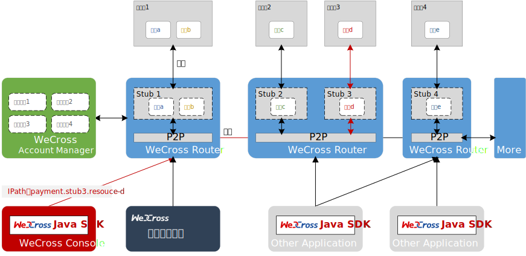

# 平台介绍

## 基本介绍

区块链作为构建未来价值互联网的重要基础设施，深度融合分布式存储、点对点通信、分布式架构、共识机制、密码学等前沿技术，正在成为技术创新的前沿阵地。全球主要国家都在加快布局区块链技术，用以推动技术革新和产业变革。经过行业参与者十年砥砺前行，目前区块链在底层技术方案上已趋于完整和成熟，国内外均出现可用于生产环境的区块链解决方案。其所面向的创新应用场景覆盖广泛，已在对账与清结算、跨境支付、供应链金融、司法仲裁、政务服务、物联网、智慧城市等众多领域落地企业级应用。

在广泛的场景应用背后，来自于性能、安全、成本、扩展等方面的技术挑战也愈发严峻。目前不同区块链应用之间互操作性不足，无法有效进行可信数据流通和价值交换，各个区块链俨然成为一座座信任孤岛，很大程度阻碍了区块链应用生态的融合发展。未来，区块链想要跨越到真正的价值互联网，承担传递信任的使命，开启万链互联时代，需要一种通用、高效、安全的区块链跨链协作机制，实现跨场景、跨地域不同区块链应用之间的互联互通，以服务数量更多、地域更广的公众群体。

作为一家具有互联网基因的高科技、创新型银行，微众银行自成立之初即高度重视新兴技术的研究和探索，在区块链领域积极开展技术积累和应用实践，不断致力于运用区块链技术提升多机构间的协作效率和降低协作成本，支持国家推进关键技术安全可控战略和推动社会普惠金融发展。微众银行区块链团队基于一揽子自主研发并开源的区块链技术方案，针对不同服务形态、不同区块链平台之间无法进行可信连接与交互的行业痛点，研发区块链跨链协作平台——WeCross，以促进跨行业、机构和地域的跨区块链信任传递和商业合作。

WeCross 着眼应对区块链行业现存挑战，不局限于满足同构区块链平行扩展后的可信数据交换需求，还进一步探索异构区块链之间因底层架构、数据结构、接口协议、安全机制等多维异构性导致无法互联互通问题的有效解决方案。作为未来区块链互联的基础设施，WeCross 秉承多方参与、共享资源、智能协同和价值整合的理念，面向公众完全开源，欢迎广大企业及技术爱好者踊跃参与项目共建。

## 关键词

* **跨链路由（WeCross Router）**
  * 与链对接，对链上的资源进行抽象
  * 向外暴露统一的接口
  * 将调用请求路由至对应的区块链
* **跨链账户服务（WeCross Account Manager）**
  * 管理跨链账户
  * Router连接所属机构的Account Manager
  * 用户在Router上登录，以跨链账户的身份发交易
* **控制台（WeCross Console）**
  * 命令行式的交互
  * 查询跨链信息，发送调用请求，操作跨链事务
* **网页管理平台**
  * 可视化操作界面
  * 查询跨链信息，发送调用请求，操作跨链事务
* **跨链 SDK（WeCross Java SDK）**
  * WeCross开发工具包，供开发者调用WeCross
  * 集成于各种跨链APP中，提供统一的调用接口
  * 与跨链路由建立连接，调用跨链路由
* **跨链资源（Resource）**
  * 各种区块链上内容的抽象
  * 包括：合约、资产、信道、数据表
* **跨链适配器（Stub）**
  * 跨链路由中对接入的区块链的抽象
  * 跨链路由通过配置Stub与相应的区块链对接
  * FISCO BCOS需配置FISCO BCOS Stub、Fabric需配置Fabric Stub
* **IPath（Interchain Path）**
  * 跨链资源的唯一标识
  * 跨链路由根据IPath将请求路由至相应区块链上
  * 在代码和文档中将IPath简称为path
* **跨链分区**
  * 多条链通过跨链路由相连，形成跨链分区
  * 跨链分区有唯一标识，即IPath中的第一项（`payment.stub3.resource-d`的`payment`）

## 更多资料

- [WeCross白皮书](https://mp.weixin.qq.com/s/w0APEAonFXbOoinMJipPAA)

- [WeCross官网](https://fintech.webank.com/wecross)
