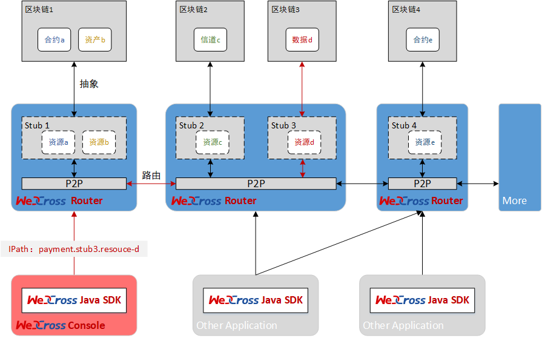

# WeCross 介绍

## 基本介绍

区块链作为多类细分技术模块的组合，深度融合了块链式数据结构、点对点通信协议、分布式架构、共识机制、密码学算法等前言技术，正在成为全球技术创新的前沿阵地。全球主要国家都在加快布局区块链技术，用以推动技术革新和产业变革。经过行业参与者十年砥砺前行，目前区块链在底层技术方案上已趋于完整和成熟，国内外均出现可用于生产环境的区块链解决方案，其所面向的创新应用场景覆盖面很广，包括对账与清结算、风险管控、跨境支付、供应链金融、司法仲裁、物联网、智慧城市、政务服务等。

广泛的场景应用背后，来自于性能、安全、成本、连接、扩展等方面的技术挑战也愈发严峻。反观当下各行业落地的区块链应用，不同联盟链的应用之间不具备互操作性，区块链间呈现出一个个信息孤岛，不同链条之间无法有效进行可信数据流通和价值交换，很大程度阻碍了区块链应用生态的融合发展。未来，区块链想要跨越到真正的价值互联网，开启万链互联时代，需要一种通用、高效、安全的区块链跨链协作机制，实现跨场景、跨地域不同区块链应用之间的互联互通，以服务数量和地域更为广大的公众人群。

作为一家具有互联网基因的高科技、创新型银行，微众银行从成立之初即高度重视新兴技术的研究和探索，在区块链领域积极开展技术积累和应用实践，不断致力于运用区块链技术提升多机构间的协作效率和降低协作成本，支持国家推进关键技术安全可控战略和推动社会普惠金融发展。微众银行基于一揽子自主研发并开源的区块链技术方案，针对不同服务形态、不同区块链平台之间无法进行可信连接与交互的行业痛点，研发了区块链跨链协作平台——WeCross，以促进跨行业、机构和地域的跨区块链价值交换和商业合作。

WeCross立足于区块链行业现存挑战，致力于解决异构区块链之间数组结构不一致、接口协议不兼容等导致无法互联互通的问题，以及满足同构区块链平行扩展后的可信数据交换。作为未来区块链万链互联的基础设施，WeCross秉承多方参与、共享资源、智能协同和价值整合的理念，面向公众完全开源，欢迎广大企业及开发者踊跃参与项目共建。

## 关键词

* **跨链路由（WeCross Router）**
  * 与链对接，对链上的资源进行抽象
  * 向外暴露统一的接口
  * 将调用请求路由至对应的区块链
* **控制台（WeCross Console）**
  * 命令行式的交互
  * 查询跨链信息，发送调用请求
* **跨链 SDK（WeCross Java SDK）**
  * WeCross开发工具包，供开发者调用WeCross
  * 集成于各种跨链APP中，提供统一的调用接口
  * 与跨链路由建立连接，调用跨链路由
* **跨链资源（Resource）**
  * 各种区块链上内容的抽象
  * 包括：合约、资产、信道、数据表
* **Stub**
  * 跨链路由中对接入的区块链的抽象
  * 跨链路由通过配置Stub与相应的区块链对接
  * FISCO BCOS需配置FISCO BCOS Stub、Fabric需配置Fabric Stub
* **IPath（Interchain Path）**
  * 跨链资源的唯一标识
  * 跨链路由根据IPath将请求路由至相应区块链上
* **跨链网络**
  * 多条链通过跨链路由相连，形成跨链网络
  * 跨链网络有唯一标识，即IPath中的第一项（`payment.stub3.resource-d`的`payment`）

## 更多资料

- [WeCross白皮书（待发布）]()

- [WeCross官网](https://fintech.webank.com/wecross)