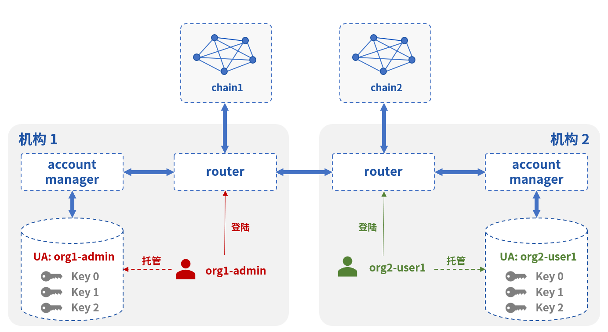

# 账户管理

## 跨链账户

### 概念

不同类型的链有不同的账户，WeCross将其进行统一管理，抽象出**跨链账户**：

* 缩写：UA（Universal Account）
* 定义
  * **跨链账户：WeCross中用户的身份**
  * 链账户：向不同类型的链发交易时，给交易签名的实际账户
* 作用：对于不同类型的链，都采用跨链账户发送交易
* 效果：对于不同类型的链，上链的交易都能映射回对应的跨链账户
* 限制：一个跨链账户可以持有多个链账户，一个链账户被一个跨链账户持有

### 原理

* 用户通过登录的方式获得跨链账户的身份
* 用户在跨链账户下可添加不同类型的链账户
* 通过互签的方式，生成UA Proof，建立跨链账户与链账户的映射
* UA Proof在router间同步，在获取交易发送者时，可结合UA Proof获取发交易的跨链账户
* 相关逻辑由WeCross Account Manager进行管理

### 举例

一个跨链账户包括以下信息：

* UA名：org1-admin
* 公私钥：aaaa、bbbb
* 链账户
  * FISCO BCOS 2.0
    * 0：公钥、私钥、地址、UA Proof、默认账户
    * 1：公钥、私钥、地址、UA Proof、非默认账户
  * FISCO BCOS 2.0 国密
    * 2：公钥、私钥、地址、UA Proof、非默认账户
    * 3：公钥、私钥、地址、UA Proof、默认账户
  * Hyperledger Fabric1.4：
    * 4：证书、私钥、MSPID、UA Proof、默认账户
    * 5 ...

## WeCross Account Manager

### 概念

* 作用：管理自己机构的跨链账户
* 架构
  * Router选择自己机构的Account Manager进行连接
  * Account Manager部署在机构内网中，外部router无法访问
* 操作
  * Router连接Account Manager后，用户在Router上进行登录
  * 登陆后，可采用此身份向跨链网络中的任意资源发交易，无论是否是此router连接的资源
* 限制
  * Router限制：Router只有连接了相应机构的Account Manager，才能启动
  * 用户限制：跨链账户数据由某个Account Manager管理，用户只能在连接了自身机构WeCross Account Manager的Router上才能登录成功



### 部署

**下载**

参考：[下载程序](../version/download.html#wecross-account-manager)

**配置**

* 配置与Router连接的公私钥

``` bash
cd WeCross-Account-Manager
cp ~/wecross/routers-payment/cert/sdk/* ./conf #从生成的router目录拷贝
```

* 生成自身加密的公私钥

``` bash
bash create_rsa_keypair.sh -d conf/ # 在conf下生成：rsa_private.pem  rsa_public.pem
```

* 写配置

``` bash
cp conf/application-sample.toml conf/application.toml
vim conf/application.toml
```

内容为

``` toml
[service] # Account Manager启动的service配置，Router连接至此service
    address = '0.0.0.0'
    port = 8340
    sslKey = 'classpath:ssl.key'
    sslCert = 'classpath:ssl.crt'
    caCert = 'classpath:ca.crt'
    sslOn = true

[admin] # 机构的admin跨链账户，第一次启动按此配置创建
    username = 'org1-admin'
    password = '123456'

[auth] # 登录后颁发登录令牌（jwt）的配置，name可修改为自身机构名
    name = 'org1'
    expires = 18000 # 5 h
    noActiveExpires = 600 # 10 min

[encrypt] # 自身加密公私钥配置
    privateKeyFile = 'classpath:rsa_private.pem'
    publicKeyFile = 'classpath:rsa_public.pem'

[db] # 数据库连接配置
    url = 'jdbc:mysql://localhost:3306/wecross_account_manager'
    username = 'jimmy'
    password = 'abc123'

[ext] # 拓展配置
    allowImageAuthCodeEmpty = true # 是否允许空验证码，设为false后控制台无法使用
```

* 启动

``` bash
bash start.sh # 停止：bash stop.sh
```

### 账户操作

用户可通过控制台和网页管理台进行操作

* 登录、登出、注册
* 添加链账户、设置默认账户、删除链账户

可直接查阅[控制台](./console.html)或[网页管理台](./webApp.html)相关部分的说明


