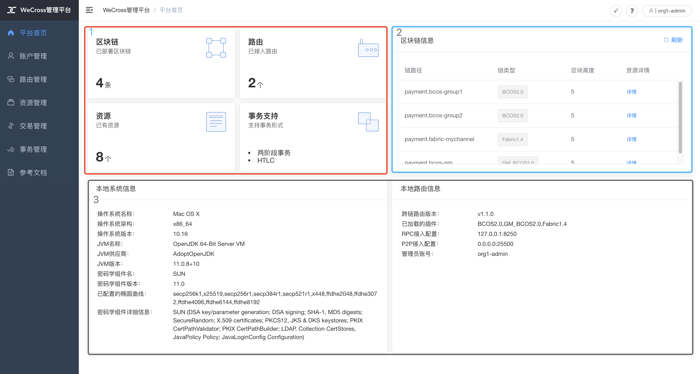
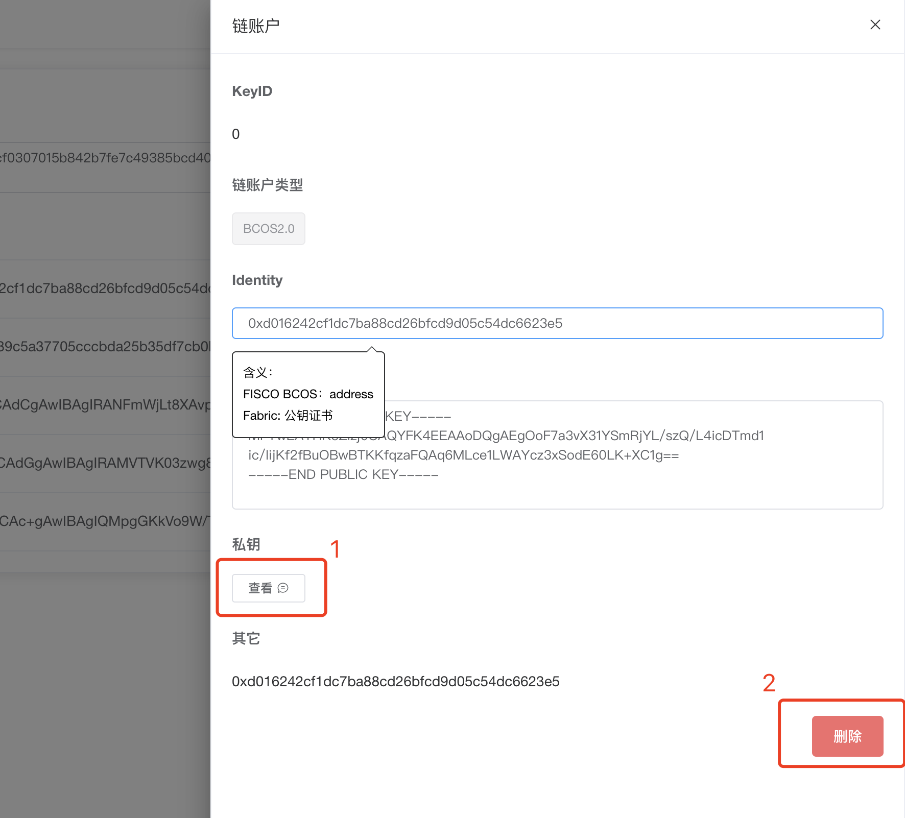
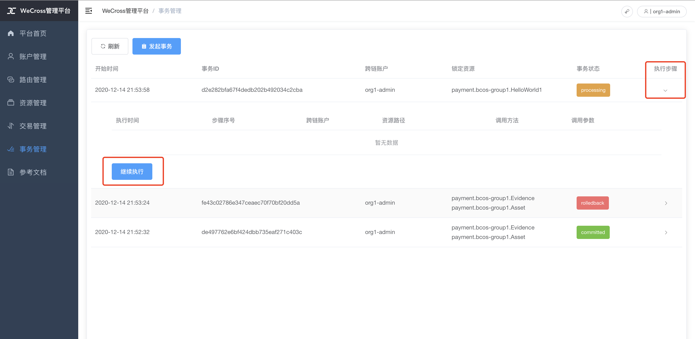

# 网页管理平台

[WeCross网页管理平台](https://github.com/WeBankBlockchain/WeCross-WebApp)是继WeCross控制台以来，更加便捷、友好的可视化客户端工具，通过发送HTTP请求与WeCross JSON-RPC接口进行跨链路由连接与通信，实现对跨链资源的读写访问等请求。WeCross网页管理平台拥有多维度的操作，包括账户管理、资源管理、路由管理、交易管理以及事务管理等多个管理模块。

可参考WeCross系列文章：[五分钟可视化演绎跨链互操作](https://mp.weixin.qq.com/s/RylwCYk48AKU9Jf7OSdqlg) 对网页管理平台的整体流程有大致了解。

本文分为[部署手册](#id1)和[使用手册](#id7)两部分，部署手册介绍WeCross网页管理平台的部署启动方式，使用手册介绍WeCross网页管理平台的实际操作和使用方式。

## 1. 部署手册

本手册主要介绍WeCross网页管理平台在使用和编译的环境要求、两种启动方式以及远程访问跨链路由的方式。

### 1.1 环境要求

- 为了您有最好的操作体验，请尽量使用[Chrome浏览器](https://www.google.cn/chrome/)，或使用支持ECMAScript 2015语法的浏览器，可参考链接：[caniuse](https://caniuse.com/es6)。*若使用过时的浏览器，有可能会出现部分功能不可使用的问题 :(*
- 若您需要进行手动源码编译网页管理平台，请确保在您的编译环境中`node.js`和`npm`版本支持ECMAScript 2015语法，可参考链接：[node.green](https://node.green/)。推荐版本为`node.js >= 8.10, npm >= 6.4.1`。

node.js及npm版本查看方式：

```bash
# node version
node -v
v8.16.0
# npm version
npm -v
6.4.1
```

### 1.2 启动方式

网页管理平台的启动方式分为两种方式：[快速体验](#id4)、[手动编译](#id6)。

#### 1.2.1 快速体验

若您是从WeCross [快速体验](../tutorial/demo/index.html)搭建的跨链Demo，那么在Demo中已经默认完成对网页管理平台的下载部署工作，您可以直接从浏览器输入以下地址即可访问：

```URL
http://localhost:8250/s/index.html#/login
```

其中`localhost`为跨链路由所配置的IP地址，`8250`为所访问的跨链路由的端口号，在这里的URL为默认配置，可根据您本地的配置进行修改。

输入后可以看到如下界面：


在快速体验Demo中，已配置默认账号`org1-admin`，可输入密码`123456`进行登录体验。

#### 1.2.2 手动编译

若您目前已经有跨链路由正在运行，请确认跨链路由的版本为`1.0.0`及以上，即可进行手动源码编译网页管理平台，进行跨链路由的访问。主要步骤如下：

1.从远程仓库拉取代码到本地；

```bash
git clone https://github.com/WeBankBlockchain/WeCross-WebApp.git

# 若因为网络原因出现长时间拉取代码失败，请尝试以下命令：
git clone https://gitee.com/WeBank/WeCross-WebApp.git
```

2.`npm`安装相关依赖，请注意[编译环境要求](#id2)；

```bash
cd WeCross-WebApp
npm install
```

3.安装完依赖以后，进行`npm`编译源代码，编译好的静态文件在`dist`文件夹中；

```bash
npm run build:prod
cd dist
```

4.在跨链路由所在文件中，创建`pages`文件夹，**注意：** 这里以`routers-payment/127.0.0.1-8250-25500`作为网页管理平台访问的跨链路由所在文件夹，实际操作请以实际情况为准；

```bash
cd ./routers-payment/127.0.0.1-8250-25500
mkdir -p pages
```

5.将`dist`文件夹中编译好的静态文件全部拷贝至刚创建的`pages`文件夹中；

```bash
cp -r ./WeCross-WebApp/dist/* ./routers-payment/127.0.0.1-8250-25500/pages/
```

6.在浏览器中输入`[跨链路由IP]:[跨链路由端口]/s/index.html`访问WeCross网页管理平台，请注意[浏览器版本要求](#id2)。

### 1.3 远程访问

若需要网页管理平台进行远程访问跨链路由，请将跨链路由所在目录的 `conf/wecross.toml` 文件，修改`[rpc]`标签下的`address`字段为所需IP（如：0.0.0.0），再通过以下命令重启当前的路由模块，在浏览器输入远程IP进行访问。

```bash
bash stop.sh && bash start.sh
```

### 1.4 开启HTTPS访问

**注意：** 请确认跨链路由的配置 `wecross.toml`中已开启SSL配置：

```toml
[rpc]
    sslSwitch = 1 # 默认为2
```

修改之后需要重新启动跨链路由。

在浏览器中导入证书，开启HTTPS：

- 根证书位于所连接的跨链路由目录下的`conf/ca.crt`
- 将`ca.crt`证书导入到浏览器

这里以Chrome浏览器为例，设置 ==> 隐私设置和安全性 ==> 高级 ==> 管理证书


### 1.5 可视化管理台变更请求URL前缀

为了运维方便，所有请求都收敛到同一个URL前缀，支持修改URL前缀。

**注意：** 该功能只支持v1.1.1版本以上的WeCross跨链路由，且只支持源码编译WeCross-WebApp。

修改方式如下，本节以`/wecross/`为例（手动编译方法请参考本文1.2.2小节）：

```shell
# 手动修改.env.production文件
# vim打开
vim .env.production
```

修改`.env.production`文件，修改规则请参考`dotenv`规则[dotenv rules](https://github.com/motdotla/dotenv#rules)或[dotenv rules gitee](https://gitee.com/mirrors_motdotla/dotenv?_from=gitee_search#rules)

```conf
ENV = 'production'
# base api
# 原配置：
# VUE_APP_BASE_API = '/'
# 修改为
VUE_APP_BASE_API = '/wecross/'
```

重新编译：

```shell
# 修改后的配置会在编译时注入配置
npm run build:prod
# 在dist生成静态文件，替换router跨链路由的pages中的静态文件，这里以~/wecross-demo/routers-payment/127.0.0.1-8250-25500/为例
cp -r ./dist/* /wecross-demo/routers-payment/127.0.0.1-8250-25500/pages
```

再次访问（这里必须保证router跨链路由也配置了URL前缀，可参考链接[router主配置](./config.html#id3)中`urlPrefix`字段）：

在浏览器输入 http://127.0.0.1:8250/wecross/s/index.html 访问。

若需要进行控制台访问修改URL前置的跨链路由router，那么也需要配置控制台的配置，可参考[控制台配置](./console.html#id12)中的`urlPrefix`字段。

## 2. 使用手册

本手册主要介绍WeCross网页管理平台的功能模块，以及各个功能的使用方法。

### 2.1 新手用户指引

对于初次登录的新手用户，将会弹框引导用户进行操作。

此外，可点击页面中 **“?”** 按钮获取更多帮助信息。


### 2.2 功能模块

WeCross网页管理平台共包含以下功能模块：

- 登录与注册模块：用户可进行Universal Account（UA）的注册和登录，UA的详细介绍可参考：[链接](./account.html)；
- 平台首页展示模块：可根据首页展示的信息大致了解已部署WeCross跨链网络的整体情况；
- 账户管理模块：用户可通过该模块查看当前UA账户信息，并进行链账户的管理；
- 路由管理模块：查看当前跨链路由的Peer路由信息；
- 资源管理模块：可对跨链资源进行查看、部署、调用等操作；
- 交易管理模块：查看所有跨链资源的每一笔交易详情，可进行跨链资源调用；
- 事务管理模块：查看所有跨链事务详情，可在页面开启/执行/结束事务；
- 其他模块：查看参考文档、快速提Issue、修改账号密码、账号登出网页等。

### 2.3 登录与注册模块

在注册模块，用户可自行申请注册一个UA账号，界面如下图所示，用户填入用户名和密码，并填入正确的验证码即可。若出现验证码不能显示的问题，请尝试刷新页面，或点击验证码手动刷新。


值得注意的是，用户名长度3～18个字符，支持数字、大小写字母、下划线_、连接符-；密码长度6~18个字符，支持数字、大小写字母、特殊字符~!@#$%^&*()，至少包含一个数字和字母。

在已有UA账户的前提下，可进行登录操作，界面如下图所示，用户填入用户名和密码，并填入正确的验证码即可。


### 2.4 平台首页展示模块

如下图所示，在登录成功后会进入`平台首页`模块，展示出已部署的WeCross跨链网络的整体信息情况。总共可分为三个部分（在图中已圈出）：

- 在第1块，展示了WeCross网页管理平台所配置的区块链条数、路由个数、总资源个数以及事务功能支持；
- 在第2块，展示了每一条链的简要信息，包括路径、类型和区块高度；
- 在第3块，展示了跨链路由的本地信息，包括运行的环境信息和本地的跨链路由系统信息。



### 2.5 账户管理模块

在账户管理模块，用户可查看当前UA的详细信息，包括账户名、账户公钥以及链账户详情，并对链账户进行默认链账户设置、添加链账户、删除链账户的操作。UA账户和链链账户的详细介绍可参考：[链接](./account.html)。

如下图所示，每一种链类型的账户都会归为一类，每种链账户都必须包含一个默认账户。可点击图中圈出的红框1，列出该链类型的所有账户；点击红框2中的按钮，可选择链账户为该类型的默认账户。点击红框3将可以进行链账户添加的操作。


点击上图中红框3之后，将会弹出页面抽屉框，如下图所示。从下拉框选择需要添加的链账户类型，页面将会根据不同链类型生成不同的表单。


添加FISCO BCOS链类型的账户方式如下图所示，可自行选择上传私钥，系统将会自动计算公钥与地址；也可以点击红框内的`生成`按钮，将会自动为您生成一套私钥、公钥和地址。**注意：** FISCO BCOS账号当前只支持上传`PEM`格式的私钥。


添加Hyperledger Fabric链类型的账户方式如下图所示，目前只支持自行上传私钥、公钥证书的方式添加Fabric链类型账户。**注意：** Hyperledger Fabric账号只支持上传`PEM、KeyStore`类型的私钥、`CRT`格式的证书。

MSPID为Fabric链账户所在的MembershipID，请以实际情况为准，这里以Org1MSP为例。（ **注意：** 输入错误将导致不能使用该链账户发起Fabric交易调用）


点击链账户中的任意一行，可查看该链账户的详细信息，如下图所示。可点击红框1查看私钥详细信息，点击红框2删除该链账户。



### 2.6 路由管理模块

用户可通过该模块查看当前跨链路由的Peer路由信息，添加新的Peer路由信息，以及设置Peer路由的别名。值得注意的是，当一个孤立路由启动时添加Peer路由信息才有效，设置Peer路由别名仅在本机环境有效。


### 2.7 资源管理模块

资源管理模块页面分为两大块，如下图所示。左边红框内的是`资源导航`，从`zone`到`chain`的树状结构，类似于Windows的资源管理界面。右边蓝框内的是`资源列表视图`，左边红框内的`资源导航`每一次点击叶子结点表示选定某条链，右边蓝框`资源列表视图`都会展示出该链的所有资源。


`资源列表视图`展示出某条链上的所有资源，包括路径、类型、具体属性的字段，可对某个资源进行操作，包括`发交易`和`查状态`两种操作。

点击按钮即会弹出对话框，可进行调用该资源，如下图所示。在红框1内的单选框，若是`发交易`，则会发送一个交易，对资源进行写操作；若是`读状态`，则是对资源的状态进行读操作，不发送交易。在红框2中`加减按钮`可对`调用参数`的个数进行修改，可减少至0个，也可增加多个。


在`资源管理`界面点击`部署合约`按钮，可进入`资源部署页面`。`资源部署页面`会以点击`部署合约`按钮时选择的链类型改变而改变。目前总共分为两大类链类型：Hyperledger Fabric和FISCO BCOS。

FISCO BCOS 资源部署页面如下图所示，操作可分为`部署合约`和`注册合约`。在红框1内填入部署的资源命名。**注意：** 在上传合约文件是，必须上传所有合约文件打包的`ZIP`压缩包，并且必须在文件夹最外层有`.sol`或`.abi`的合约文件。

上传之后，红框2的`合约入口文件`下拉框会列出压缩包内最外层的所有合约文件，在确认执行部署之后，网页会自动读取`合约入口文件`，并解析合约之间的依赖，所以 **必须在压缩包内包含入口合约的所有依赖合约** 。在合约类名中填入`合约入口文件`的类名。


为了用户更好地体验FISCO BCOS部署流程，我们已准备打包压缩好的FISCO BCOS Solidity合约包，供用户下载体验：

| 合约名           | 下载链接                                                                                                                             | 合约类名         |
|------------------|--------------------------------------------------------------------------------------------------------------------------------------|------------------|
| 资产转账合约     | [AssetSample](https://osp-1257653870.cos.ap-guangzhou.myqcloud.com/WeCross/Resources/solidity-webApp-demo/AssetSample.zip)           | Asset            |
| 存证合约         | [EvidenceSample](https://osp-1257653870.cos.ap-guangzhou.myqcloud.com/WeCross/Resources/solidity-webApp-demo/EvidenceSample.zip)     | Evidence         |
| HelloWeCross     | [HelloWeCross](https://osp-1257653870.cos.ap-guangzhou.myqcloud.com/WeCross/Resources/solidity-webApp-demo/HelloWeCross.zip)         | HelloWeCross     |
| HelloWorld       | [HelloWorld](https://osp-1257653870.cos.ap-guangzhou.myqcloud.com/WeCross/Resources/solidity-webApp-demo/HelloWorld.zip)             | HelloWorld       |
| LedgerSampleHTLC | [LedgerSampleHTLC](https://osp-1257653870.cos.ap-guangzhou.myqcloud.com/WeCross/Resources/solidity-webApp-demo/LedgerSampleHTLC.zip) | LedgerSampleHTLC |

Hyperledger Fabric 部署页面如下图所示，Fabric的操作分为`安装合约`、`实例化合约`以及`升级合约`。在`安装合约`时，填入的`所属机构名`为当前UA的Fabric1.4类型的默认链账户所属的机构。

**特别注意：** 由于Fabric的原因，在安装合约的时候，必须符合以下条件：

1. 上传 **GZIP** 格式压缩打包的chaincode文件，即`tar.gz`压缩格式；
2. chaincode合约 **必须** 在文件夹`src/chaincode`目录下再进行压缩打包，否则将会出现chaincode合约找不到的问题。例如图中的`asset.tar.gz`，解压缩后文件结构如下：

```bash
tree -L 3 src
src
└── chaincode
    └── assetSample.go
```


因为Hyperledger Fabric的特性，安装的合约必须实例化/升级实例化才能正常地显示在资源列表中。Hyperledger Fabric 实例化/升级实例化页面如下图所示。`机构列表`应填入所有参与实例化机构的列表，必须以`JSON`数组的形式填入，`其他参数`也同理。`背书策略`可上传`YAML`格式的背书文件，若不上传则默认为空。


为了用户更好地在网页管理平台体验Hyperledger Fabric部署流程，我们已额外准备打包压缩好的Fabric部署流程，我们已准备打包压缩好的FISCO chaincode合约包，供用户下载体验：

| 合约名            | 下载链接                                                                                                                 | 实例化参数 |
|-------------------|--------------------------------------------------------------------------------------------------------------------------|------------|
| 资产转账chaincode | [asset](https://osp-1257653870.cos.ap-guangzhou.myqcloud.com/WeCross/Resources/chaincode-webApp-demo/asset.tar.gz)       | []         |
| 存证合约          | [evidence](https://osp-1257653870.cos.ap-guangzhou.myqcloud.com/WeCross/Resources/chaincode-webApp-demo/evidence.tar.gz) | []         |
| htlc              | [htlc](https://osp-1257653870.cos.ap-guangzhou.myqcloud.com/WeCross/Resources/chaincode-webApp-demo/htlc.tar.gz)         | []         |
| sacc              | [sacc](https://osp-1257653870.cos.ap-guangzhou.myqcloud.com/WeCross/Resources/chaincode-webApp-demo/sacc.tar.gz)         | ["a","10"] |

### 2.8 交易管理模块

用户可通过交易管理模块查看所有跨链资源的每一笔交易详情，进行跨链资源调用。界面如下图所示，与[资源管理模块](#id13)相似，分为两大块，右边蓝框1内为`交易列表视图`，展示所选定的链所有交易信息，包含交易哈希、账户、区块高度、资源、调用方法和回执等信息，点击蓝框2内可查看这一行交易的回执详细信息。


### 2.9 事务管理模块

用户可通过事务管理模块查看所有跨链事务详情，可在页面开始、执行、提交/回滚事务。界面如下图所示，界面展示了当前WeCross网络的事务列表。列表包含事务开始时间、事务ID、跨链账户、锁定资源、事务状态的字段，事务状态包含`processing`、`rolledback`和`committed`三种状态。点击`执行步骤`，可查看该事务的详细步骤。若状态为`processing`，则可以点击`继续执行按钮`，恢复到该事务上下文。



在事务管理页面点击发起事务，则可以进入事务开启页面。事务开启页面如下所示，分为三大块，红框1展示了事务步骤状态；红框2中是开启事务参数的选择，页面将自动生成一个UUID作为事务ID，使用`待选资源穿梭框`勾选开启事务所需要的资源，添加到右侧的`已选资源列表`；完成选择后点击红框3开启事务。


开启事务后进入执行事务步骤，界面如下图所示，左边为发交易表单，与`资源管理模块`的发交易类似，左边为事务步骤的列表，记录每一步的操作。
若希望结束当前事务，即提交/回滚当前事务，可点击最下方的`结束事务按钮`。


在点击结束事务后进入结束事务步骤，界面如下图所示，展示该事务的所有详细信息。可点击下方的继续执行，返回执行事务步骤，也可选择提交/回滚事务，对事务进行结束。


若一切正常，则会展示已结束当前事务界面。可选择点击`再开启一段事务`按钮再次重启事务，也可点击`查看事务列表`按钮，跳转到事务管理页面。


### 2.10 其他模块

可通过点击界面右上角的`用户`按钮，将弹出下拉框，可点击修改密码选项进入修改密码界面。


进入`设置新的密码`页面，输入旧密码、重复输入新密码，再输入验证码即可设置新密码。新密码不能与旧密码相同，新密码格式与注册密码一致。


通过点击界面右上角的`鸡腿`按钮，可打开`Contributor`下拉框。


欢迎通过以上按钮，对我们WeCross的产品进行提Issue、提Bug、提需求，也欢迎各位参与到我们的社区中，来领取Task任务，打怪升级，赢得任务奖励！:)

详情可参考：[参与社区](../community/community.html)
