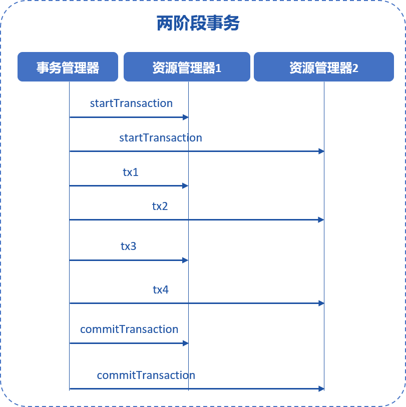
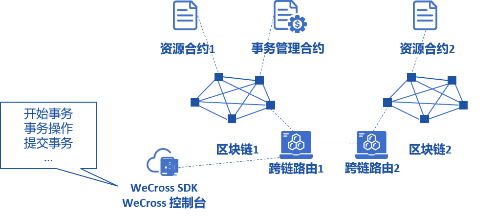

# 两阶段事务

两阶段事务是分布式数据库和分布式系统中常见的事务模型，两阶段事务的架构中包含事务管理器和资源管理器等多个角色。



在WeCross事务模型中，资源管理器是各个参与事务的区块链，事务管理器由WeCross的跨链路由实现，WeCross跨链路由对多个区块链上的资源进行事务的调度和管理。

用户使用WeCross SDK，可以同时操作多个跨链路由和多个链上的资源，参与一个两阶段事务，确保事务过程中所有资源的原子性。



## 准备工作

无论何种链、智能合约或链码，参与基本的两阶段事务流程时不需要提前做修改，但如果要支持两阶段事务的回滚操作，资源的实现中必须包含与正向交易接口相反的“反向”交易接口，以Solidity智能合约为例，为了支持两阶段事务的回滚操作需要做修改：

原Solidity合约包含一个正向交易接口，如转账：

```solidity

function transfer(string memory from, string memory to, int balance) public {
// balance check...
    balances[from] -= balance;
    balances[to] += balance;
}

```

注意，案例为了简明考虑，此处省略了余额和透支检查的逻辑，只列出了正向交易接口的关键逻辑

可以看出，正向交易接口的逻辑是将from的余额减少，等量增加to的余额，实现了余额从from转移到to的效果。当事务成功执行时，正向交易接口的执行结果将被认可，一旦事务出现异常，需要回滚时，Solidity合约需要提供一个反向交易接口。

反向交易接口的参数与正向交易接口相同，函数名增加_revert的后缀，表明这是一个用于两阶段事务的反向交易接口，当两阶段事务需要回滚时，WeCross会自动执行Solidity合约的反向交易接口，反向交易接口实现如下：

```solidity

function transfer_revert(string memory from, string memory to, int balance) public {
  // balance check...
  balance[from] += balance;
  balance[to] -= balance;
}

```

反向交易接口的逻辑与正向接口相反，将from的余额增加，等量减少to的余额，实现了余额从to转移到from的效果，在相同输入参数的情况下其行为和执行结果与正向交易接口相反。

WeCross跨链路由在事务执行失败时，会按照正向交易接口执行的顺序，以相反的顺序调用反向交易接口。

举例，两阶段事务过程中执行了一系列正向交易接口如下：

```bash

transfer1('from1', 'to1', 100)
transfer2('from2', 'to2', 200)
transfer3('from3', 'to3', 300)

```

当事务发生异常，WeCross会按以下顺序执行反向交易接口：

```bash

transfer3_revert('from3', 'to3', 300)
transfer2_revert('from2', 'to2', 200)
transfer1_revert('from1', 'to1', 100)

```

## 使用

两阶段事务无需事先配置即可使用，如果需要使用两阶段事务的回滚功能，则要求参与事务的资源都实现了反向交易接口。

## 控制台使用两阶段事务

### 开始两阶段事务

使用startTransaction命令，开始两阶段事务

```bash

startTransaction [path_1] ... [path_n]

```

参数解析：

- path_1 ... path_n：参与事务的资源路径列表，路径列表中的资源会被本次事务锁定，锁定后仅限本事务相关的交易才能对这些资源发起写操作，非本次事务的所有写操作都会被拒绝

例子：

开始一个事务，资源为zone.chain.res1

```bash

startTransaction zone.chain.res1

```

开始一个事务，事务ID为200，账号为account、fabric，资源为zone.chain.res1、zone.chain.res2

```bash

startTransaction zone.chain.res1 zone.chain.res2

```

### 发起事务交易

使用execTransaction命令，发起事务交易，execTransaction命令与sendTransaction命令类似。

任何资源一旦参与了事务，就无法用sendTransaction来向该资源发送交易，必须使用execTransaction

```bash

execTransaction [path] [method] [args]

```

参数解析：

- path：资源路径
- method：接口名，同sendTransaction
- args：参数，同sendTransaction

例子：

通过控制台，调用transfer接口：

```bash

execTransaction zone.chain.res1 transfer 'fromUserName' 'toUserName' 100 #调用事务资源zone.chain.res1的transfer接口

execTransaction zone.chain.res2 transfer 'fromUserName' 'toUserName' 100 #调用事务资源zone.chain.res2的transfer接口

```

### 提交事务

使用commitTransaction命令，提交事务，确认事务执行过程中所有的变动。

```bash

commiTransaction [path_1] ... [path_n]

```

参数解析：

- path_1 ... path_n：用于提交事务的路径列表，此处填写所有参与了事务的链，无需精确到参与事务的资源，填入链的路径即可

例子：

通过控制台，执行一个完整的事务步骤

```bash

startTransaction zone.chain.res1 zone.chain.res2 #开始事务

execTransaction zone.chain.res1 transfer 'fromUserName' 'toUserName' 100 #调用事务资源zone.chain.res1的transfer接口
execTransaction zone.chain.res2 transfer 'fromUserName' 'toUserName' 100 #调用事务资源zone.chain.res2的transfer接口

commitTransaction zone.chain #提交事务

```

### 回滚事务

当事务的某个步骤执行失败，需要撤销本次事务的所有变更时，使用rollbackTransaction命令

```bash

rollbackTransaction [path_1] ... [path_n]

```

参数解析：

- path_1 ... path_n：用于回滚事务的路径列表，此处填写所有参与了事务的链，无需精确到参与事务的资源，填入链的路径即可

例子：

通过控制台，执行一个完整的事务步骤

```bash

startTransaction zone.chain.res1 zone.chain.res2 #开始事务

execTransaction zone.chain.res1 transfer 'fromUserName' 'toUserName' 100 #调用事务资源zone.chain.res1的transfer接口
execTransaction zone.chain.res2 transfer 'fromUserName' 'toUserName' 100 #调用事务资源zone.chain.res2的transfer接口
execTransaction zone.chain.res2 set 'fromUserName' 'property' "true"  #调用事务资源zone.chain.res2的set接口，假设该接口调用失败

rollbackTransaction zone.chain #回滚事务

```
