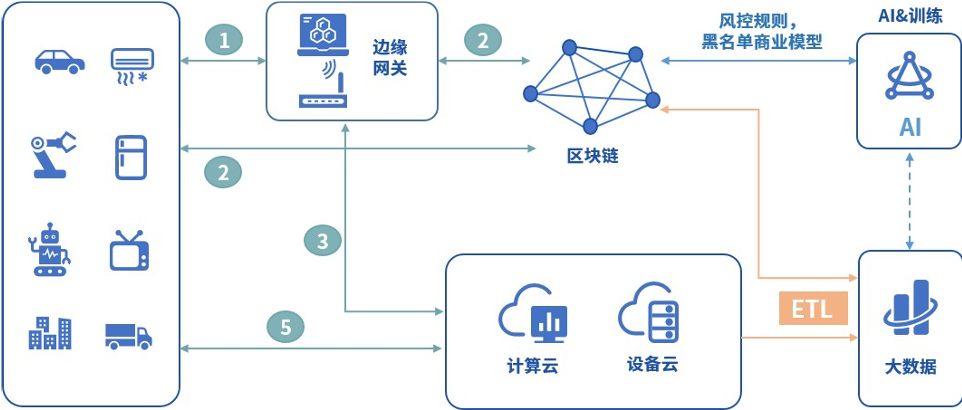

# 物联网跨平台联动

随着智能穿戴、智能家居、无人机及以人脸识别等人工智能设备的普及，智能设备的类别越来越多，人机交互的频次也越来越高，物联网数据的类型和结构呈现多样化和复杂化的趋势。在5G时代，实现万物互联之后，数据和场景的复杂度更是呈几何倍数增长。区块链技术为物联网设备提供信任机制，保证所有权、交易等记录的可信性、可靠性及透明性，同时还可为用户隐私提供保障机制，从而有效解决物联网发展面临的大数据管理、信任、安全和隐私等问题，推进物联网向更加灵活化、智能化的形态演进。

目前物联网行业的区块链项目，有的旨在解决物联网碎片化严重、物联网产品没有标准化等痛点，有的则探索区块链在智能城市、基础设施、智能电网、供应链以及运输等领域的应用。然而，它们都面临着相同的困境。物联网设备硬件模块的选择和组合非常多样，对区块链平台的支持能力不尽相同，一旦硬件部署完成后难以更新，单一的区块链平台在连通多样化的物联网设备时必然会遇到瓶颈，无法全面满足所有物联网设备在多样化场景中的需求。

WeCross跨链技术支持物联网设备跨链平行扩展，可用于构建高效、安全的分布式物联网网络，以及部署海量设备网络中运行的数据密集型应用；WeCross跨链技术可以安全可信地融合连通多个物联网设备的区块链，在功能和安全上满足多样的场景需求。
