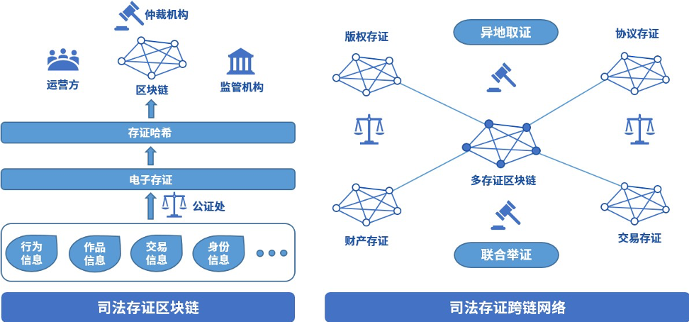

# 司法跨域仲裁

随着数字经济高速发展，司法证据正逐步进入电子化时代。2017年9月，微众银行区块链团队与第三方存证公司合作，推出区块链司法存证与仲裁平台，开创将仲裁、法院等机构作为链上节点的先河，并于2018年2月，联合仲裁机构基于该平台出具业内首份裁决书，标志着区块链应用在司法领域的真正落地并完成价值验证；2018年6月，杭州互联网法院开始探求区块链在司法场景中的运用，进一步确立了区块链存证电子证据的合法性；2018年9月，北京互联网法院推出电子证据平台“天平链”，加速推动在网络空间治理的法治化进程。由于区块链司法应用能够极大缩减仲裁流程，仲裁机构得以快速完成证据核实，快速解决纠纷。

随着区块链应用在司法存证领域的普及，不同司法存证链之间连通的需求愈发强烈。但区块链的信任模型使得不同的司法存证链上的证据无法互通互信，当司法仲裁需要异地取证或是联合举证时，需要引入一个中心化的可信机构来进行协调，影响了区块链的实用价值。

WeCross跨链技术可以将各家存证链的证据统一抽象成证据资源，在不同的司法存证链之间可信地传输证据。WeCross可以搭建一个拥有多类型存证的存证链网络，在面向重大问题和重大纠纷时，去中心化地帮助各个链交互完备、可信和强有力的证据材料，帮助仲裁机构完成裁决。
