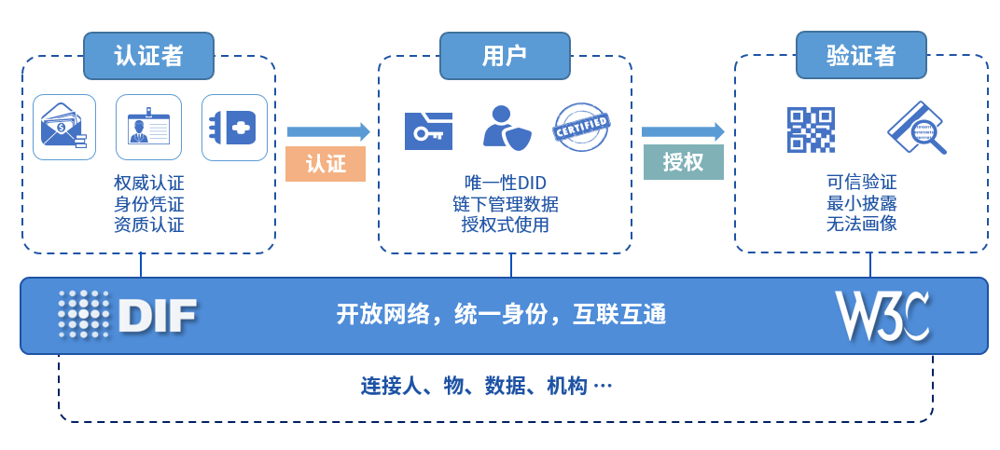

# 个体数据跨域授权

区块链天然具有金融属性，有望为金融业带来更多创新。支付清算方面，在基于区块链技术的架构下，市场多个参与者维护的多个账本或区块链融合连通并实时交互，短短几分钟内就能完成现在两三天才能完成的支付、对账、清算任务，降低了跨行跨境交易的复杂性和成本；同时，区块链技术能够确保交易记录透明安全，方便监管部门追踪链上交易，快速定位高风险交易流向。数字票据和供应链金融方面，区块链技术可以有效解决中小企业融资难问题。目前的供应链金融很难惠及产业链上游的中小企业，因为他们跟核心企业往往没有直接贸易往来，金融机构难以评估其信用资质。基于区块链技术，可以建立一种联盟多链网络，涵盖核心企业、上下游供应商、金融机构等，核心企业发放应收账款凭证给其供应商，票据数字化上链后可在供应商之间跨链流转，每一级供应商可凭数字票据实现对应额度的融资。

伴随着区块链在金融领域落地应用的飞速增长，多元化的数字资产场景和区块链应用带来了区块链资产相互隔离的问题，不同数字资产业务彼此搭建的区块链上的数字资产无法安全可信地实现互通，区块链上存在的数字资产价值越来越大，跨链的需求愈发迫切。

WeCross支持以多种网络拓扑模型搭建数字资产的跨链分区。在交易逻辑上，两阶段事务模型和HTLC事务模型将实现数字资产的去中心、去信任和不可篡改的转移。在安全防护上，加密和准入机制将保障数字资产转移的安全与可信。通过以上技术优势，WeCross将助力过去纸质形态的资产凭证全面数字化，让资产和信用层层深入传递到产业链末端，促进数字经济的发展。
