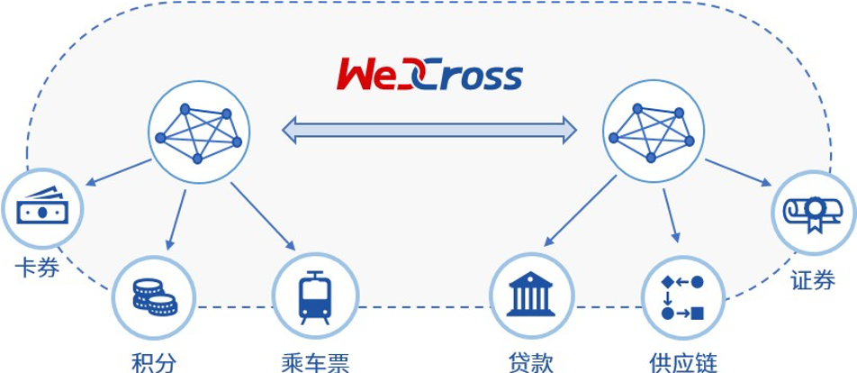

# 数字资产跨链

随着WeIdentity、Hyperledger Indy等遵循DID协议的区块链身份认证系统出现，多个国家和地区开展了多中心化身份认证的实践与落地，多中心化身份认证目前市场需求巨大，加之政策鼓励支持，行业方兴未艾，处于高速发展的黄金时期。2019年2月27日，微众银行区块链团队与澳门政府设立的澳门科学技术发展基金签署合作协议，在智慧城市、民生服务、政务管理、人才培训等方面开展合作。双方合作的首个项目基于“WeIdentity”的实体身份标识及可信数据交换解决方案展开，这是区块链在粤港澳大湾区应用落地的重要一步。

身份认证正向跨地域的方向发展，不同地域、业务和基于不同区块链平台的身份认证产品之间尚不能互认的现状造成信息的鸿沟，导致身份和资质等数据仍然局限在小范围的地域和业务内， 无法互通。

WeCross 可以将多个不同架构、行业和地域的多中心化身份认证平台联结起来，帮助多中心化身份认证更好地解决数据孤岛、数据滥用和数据黑产的问题，在推进数据资源开放共享与信息流通，促进跨行业、跨领域、跨地域大数据应用，形成良性互动的产业发展格局上，发挥更大的作用。
