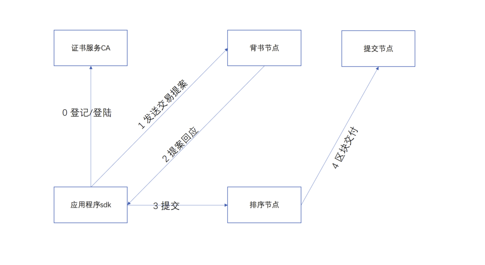

# 接入Fabric

## Fabric环境搭建

## 前置准备工作
#### docker安装

docker安装需要满足内核版本不低于3.10。

##### centos环境下docker安装
###### 卸载旧版本
```
sudo yum remove docker docker-common docker-selinux docker-engine
```
###### 安装依赖
```
sudo yum install -y yum-utils device-mapper-persistent-data lvm2
```

###### 设置yum源
```
sudo  yum-config-manager --add-repo https://download.docker.com/linux/centos/docker-ce.repo
```

###### 安装docker
```
sudo yum install docker-ce
```

###### 启动docker
```
service docker start
```

##### ubuntu环境下docker安装
###### 卸载旧版本
```
sudo apt-get remove docker docker-engine docker-ce docker.io
```

###### 更新apt包索引
```
sudo apt-get update
```

###### 安装HTTPS依赖库
```
sudo apt-get install -y apt-transport-https ca-certificates curl software-properties-common
```

###### 添加Docker官方的GPG密钥
```
curl -fsSL https://download.docker.com/linux/ubuntu/gpg | sudo apt-key add -
```
###### 设置stable存储库
```
sudo add-apt-repository "deb [arch=amd64] https://download.docker.com/linux/ubuntu $(lsb_release -cs) stable"
```

###### 更新apt包索引
```
sudo apt-get update
```

###### 安装最新版本的Docker-ce
```
sudo apt-get install -y docker-ce
```

###### 启动docker
```
service docker start
```

#### docker-compose安装
##### 安装docker-compose
```
sudo curl -L "https://github.com/docker/compose/releases/download/1.18.0/docker-compose-$(uname -s)-$(uname -m)" -o /usr/local/bin/docker-compose
sudo chmod +x /usr/local/bin/docker-compose
sudo ln -s /usr/local/bin/docker-compose /usr/bin/docker-compose
```

##### 查看docker-compose版本
```
    docker-compose --version
    docker-compose version 1.18.0, build 8dd22a9
```

#### go安装
##### 安装go
```
    wget https://dl.google.com/go/go1.11.5.linux-amd64.tar.gz
    sudo tar zxvf go1.11.5.linux-amd64.tar.gz -C /usr/local
```
#####  环境变量配置
###### 创建文件夹和软链
```
cd ~
mkdir /data/go
ln -s /data/go go
```

###### 修改环境变量

```
sudo vim /etc/profile
```
添加如下内容:
```
export PATH=$PATH:/usr/local/go/bin
export GOROOT=/usr/local/go
export GOPATH=/data/go/
export PATH=$PATH:$GOROOT/bin
```

修改完成后,执行如下操作:
```
    source /etc/profile
```

###### 确认go环境安装成功
新增helloworld.go文件，内容如下：
```
    package main
    import "fmt"
    func main() {
    fmt.Println("hello world.")
    }
```

运行helloworld.go文件
```
    go run helloworld.go
```
如果安装和配置成功,将输出:
```
    hello world.
```

请确保这一步可以正常输出，如果不能正常输出，请检查go的版本以及环境变量配置。

#### Fabric链搭建
##### 目录准备
```
    cd ~
    mkdir go/src/github.com/hyperledger -p
    cd go/src/github.com/hyperledger
```
##### 源码下载
```
    git clone -b release-1.4 https://github.com/hyperledger/fabric.git
    git clone -b release-1.4 https://github.com/hyperledger/fabric-samples.git
```
##### 源码编译
```
    cd ~/go/src/github.com/hyperledger/fabric
    make release
```
##### 环境变量修改
sudo vi /etc/profile 新增如下一行
```
    export PATH=$PATH:$GOPATH/src/github.com/hyperledger/fabric/release/linux-amd64/bin
```
修改完成后执行
```
    source /etc/profile
```
##### 节点启动
```
    cd ~/go/src/github.com/hyperledger/fabric-samples/first-network
    ./byfn.sh up
```

##### 验证
执行如下命令，进入容器
```
    sudo docker exec -it cli bash
```
进入操作界面，执行如下命令:
```
    peer chaincode query -C mychannel -n mycc -c '{"Args":["query","a"]}'
    peer chaincode invoke -o orderer.example.com:7050 --tls true --cafile /opt/gopath/src/github.com/hyperledger/fabric/peer/crypto/ordererOrganizations/example.com/orderers/orderer.example.com/msp/tlscacerts/tlsca.example.com-cert.pem -C mychannel -n mycc --peerAddresses peer0.org1.example.com:7051 --tlsRootCertFiles /opt/gopath/src/github.com/hyperledger/fabric/peer/crypto/peerOrganizations/org1.example.com/peers/peer0.org1.example.com/tls/ca.crt --peerAddresses peer0.org2.example.com:9051 --tlsRootCertFiles /opt/gopath/src/github.com/hyperledger/fabric/peer/crypto/peerOrganizations/org2.example.com/peers/peer0.org2.example.com/tls/ca.crt -c '{"Args":["invoke","b","a","1"]}'
    peer chaincode query -C mychannel -n mycc -c '{"Args":["query","a"]}'
```

## Fabric stub配置

### Fabric证书介绍

Fabric交易执行流程如下图:


从图中可以看出，和交易sdk直接交互的CA节点，背书节点和排序节点。
所以需要配置的证书包括：
1 CA证书，包括用户私钥和证书文件。
2 背书节点证书，背书节点有多少个就需要拷贝多少个背书节点证书。
3 排序节点证书。


### Fabric证书路径说明

访问Fabric链依赖的证书需要从链上拷贝，以上面搭建的链为例，说明相关证书文件路径。

首先进入容器
```
    sudo docker exec -it cli bash
```
### CA证书路径

CA证书是分用户的，如果用户为Admin,则用户私钥和证书文件的路径分别为
```
    #私钥文件
    /opt/gopath/src/github.com/hyperledger/fabric/peer/crypto/peerOrganizations/org1.example.com/users/Admin@org1.example.com/msp/keystore/*_sk

    #证书文件
    /opt/gopath/src/github.com/hyperledger/fabric/peer/crypto/peerOrganizations/org1.example.com/users/Admin@org1.example.com/msp/signcerts/Admin@org1.example.com-cert.pem

```

如果用户是User1,则用户私钥和证书文件的路径分别为:

```
    #私钥文件
    /opt/gopath/src/github.com/hyperledger/fabric/peer/crypto/peerOrganizations/org1.example.com/users/User1@org1.example.com/msp/keystore/*_sk

    #证书文件
    /opt/gopath/src/github.com/hyperledger/fabric/peer/crypto/peerOrganizations/org1.example.com/users/User1@org1.example.com/msp/signcerts/User1@org1.example.com-cert.pem

```

### 背书节点证书

按照上面步骤部署出来的链码有两个背书节点，路径分别为:

```
    #peer0.org1证书
    /opt/gopath/src/github.com/hyperledger/fabric/peer/crypto/peerOrganizations/org1.example.com/peers/peer0.org1.example.com/tls/ca.crt

    #peer0.org2证书

    /opt/gopath/src/github.com/hyperledger/fabric/peer/crypto/peerOrganizations/org2.example.com/peers/peer0.org2.example.com/tls/ca.crt

```


### 排序节点证书

按照上面步骤部署出来的链码有一个排序节点，路径为:

```
    /opt/gopath/src/github.com/hyperledger/fabric/peer/crypto/ordererOrganizations/example.com/orderers/orderer.example.com/msp/tlscacerts/tlsca.example.com-cert.pem
```

### Fabric stub配置

WeCross配置好之后，默认的conf目录结构如下：

```
├── log4j2.xml
├── p2p
│   ├── ca.crt
│   ├── node.crt
│   ├── node.key
│   └── node.nodeid
├── stubs
│   ├── bcos
│   │   └── stub-sample.toml
│   ├── fabric
│       └── stub-sample.toml
├── wecross-sample.toml
└── wecross.toml
```

假定当前目录在conf，执行如下操作:
```
    cd stubs/fabric;
    cp stub-sample.toml  stub.toml
```

执行上述命令之后，目录结构变成如下：
```
├── log4j2.xml
├── p2p
│   ├── ca.crt
│   ├── node.crt
│   ├── node.key
│   └── node.nodeid
├── stubs
│   ├── bcos
│   │   └── stub-sample.toml
│   ├── fabric
│       └── stub-sample.toml
│       └── stub.toml
│
├── wecross-sample.toml
└── wecross.toml
```

查看stub.toml，可以看到文件内容如下：
```
[common]
    stub = 'fabric'
    type = 'FABRIC'

# fabricServices is a list
[fabricServices]
     channelName = 'mychannel'
     orgName = 'Org1'
     mspId = 'Org1MSP'
     orgUserName = 'Admin'
     orgUserKeyFile = 'classpath:/stub/fabric/orgUserKeyFile'
     orgUserCertFile = 'classpath:/stub/fabric/orgUserCertFile'
     ordererTlsCaFile = 'classpath:/stub/fabric/ordererTlsCaFile'
     ordererAddress = 'grpcs://127.0.0.1:7050'  
[peers]
    [peers.org1]
        peerTlsCaFile = 'classpath:/stub/fabric/peerOrg1CertFile'
        peerAddress = 'grpcs://127.0.0.1:7051'
    [peers.org2]
         peerTlsCaFile = 'classpath:/stub/fabric/peerOrg2CertFile'
         peerAddress = 'grpcs://127.0.0.1:9051'
           
# resources is a list
[[resources]]
    # name cannot be repeated
    name = 'HelloWorldContract'
    type = 'FABRIC_CONTRACT'
    chainCodeName = 'mycc'
    chainLanguage = "go"
    peers=['org1','org2']
```

需要配置的项包括：

```orgUserName```:用户名称，按照上面搭出来的链可选为```Admin```或者```User1```。

```orgUserKeyFile```:用户私钥文件，需要从链上拷贝，文件路径请参考[ca证书路径](./fabric.html#ca)。请拷贝文件,修改文件名为```orgUserKeyFile```并将文件拷贝到```conf/stub/fabric```目录。

```orgUserCertFile```:用户证书文件，需要从链上拷贝。文件路径请参考[ca证书路径](./fabric.html#ca)。请拷贝文件,修改文件名为```orgUserCertFile```并将文件拷贝到```conf/stub/fabric```目录。

```ordererTlsCaFile```:排序节点证书文件，需要从链上拷贝。文件路径请参考[排序节点证书路径](./fabric.html#id27)。请拷贝文件,修改文件名为```ordererTlsCaFile```并将文件拷贝到```conf/stub/fabric```目录。

```ordererAddress```:排序节点地址，将默认的```127.0.0.1```改成真实ip。

```peerTlsCaFile```:背书节点证书文件，需要从链上拷贝。文件路径请参考[背书节点证书路径](./fabric.html#id26)。请拷贝对应的两个文件,分别修改文件名为```peerOrg1CertFile```和```peerOrg2CertFile```，并将文件拷贝到```conf/stub/fabric```目录。

```peerAddress```:背书节点地址，将默认的```127.0.0.1```改成真实ip。


### Fabric环境搭建常见问题定位

1.  启动docker提示:```dial unix /var/run/docker.sock: connect: `permission denied````
解决方案：将当前用户加入到docker用户组
```
    sudo gpasswd -a ${USER} docker
```


2 节点启动或者停止过程出现类似```ERROR: for peer0.org2.example.com  container 4cd74d7c81ed915ebee257e1b9d73a0b53dd92447a44f7654aa36563adabbd06: driver "overlay2" failed to remove root filesystem: unlinkat /var/lib/docker/overlay2/14bc15bfac499738c5e4f12083b2e9907f5a304ff234d68d3ba95eef839f4a31/merged: device or resource busy```错误。

解决方案:获得所有和docker相关的进程，找到正在使用的设备号对应的进程，kill掉进程。

```
    grep docker /proc/*/mountinfo | grep 14bc15bfac499738c5e4f12083b2e9907f5a304ff234d68d3ba95eef839f4a31 | awk -F ':' '{print $1}' | awk -F'/' '{print $3}'
```


