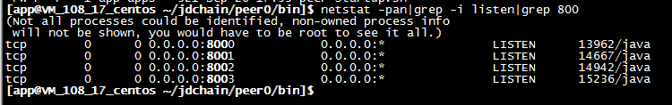

# 接入JDChain

## JDChain逻辑架构图


## JDChain部署流程


为简化部署条件、方便开发者学习，我们的示例使用一台服务器进行部署演示，因此我们将4个共识节点的端口进行如下约定：
管理工具的端口定义分别为：8000/8001/8002/8003
peer节点的启动端口定义为：7080/7081/7082/7083
请确保上述端口没有被占用。

### 附件下载和解压 
```
mkdir ~/jdchain
cd  ~/jdchain
wget http://storage.jd.com/jd.block.chain/jdchain-peer-1.1.0.RELEASE.zip
 mkdir ~/jdchain/peer0/
 mkdir ~/jdchain/peer1/
 mkdir ~/jdchain/peer2/
 mkdir ~/jdchain/peer3/
 unzip jdchain-peer-1.1.0.RELEASE.zip -d ~/jdchain/peer0/
 unzip jdchain-peer-1.1.0.RELEASE.zip -d ~/jdchain/peer1/
 unzip jdchain-peer-1.1.0.RELEASE.zip -d ~/jdchain/peer2/
 unzip jdchain-peer-1.1.0.RELEASE.zip -d ~/jdchain/peer3/
```

### 修改manager和peer监听端口

#### 修改manager监听端口
分别针对~/jdchain/peer1/ ~/jdchain/peer2/ ~/jdchain/peer3/目录下manager-startup.sh文件修改监听端口，分别修改为8001,8002,8003
```
cd ~/jdchain/peer1/bin/
vi manager-startup.sh
```


#### 修改peer监听端口
分别针对~/jdchain/peer1/ ~/jdchain/peer2/ ~/jdchain/peer3/目录下peer-startup.sh文件修改监听端口,分别改为7081，7082，7083
```
cd ~/jdchain/peer1/bin/
vi peer-startup.sh
```


### 启动管理端

<font color=#A52A2A size=4 >四个节点</font>对应端口的管理工具，例如：http://192.168.0.1:8000<font color=#A52A2A size=4 >（请自行替换对应ip和端口）</font>

通过如下命令启动管理端
```
cd  ~/jdchain/peer0/bin
sh manager-startup.sh

cd  ~/jdchain/peer1/bin
sh manager-startup.sh

cd  ~/jdchain/peer2/bin
sh manager-startup.sh

cd  ~/jdchain/peer3/bin
sh manager-startup.sh

```
启动完成后，可以看到服务器新增了8000~8003的端口监听。同时可以使用 tail -f jump.out查看日志。



### 创建公私钥

分别登录<font color=#A52A2A size=4 >四个节点</font>对应端口的管理工具，例如：http://192.168.0.1:8000<font color=#A52A2A size=4 >（请自行替换对应ip和端口）</font>

点击左侧菜单：公私钥管理→生成公私钥。在弹出的界面中填写相关信息：


### 账本初始化
创建数据账本时，四个节点需要指定其中一个作为协调方，发起账本的创建。另外三个作为参与方，接受协调方的邀请码，共同创建数据账本。

点击左侧菜单：账本→初始化账本。


<font color=#A52A2A size=4 >四个节点都配置完成后，请确保四个peer节点的配置均无误的前提下，在尽可能短的时间内同时点击界面下方的“保存配置信息”按钮。</font>


协调方配置信息参考如下：


参与配置信息参考如下：


四个参与方都点击“保存配置信息”后，配置信息会在四个参与方之间共享。界面如下：


然后点击界面下方的“开始”按钮，则启动四个参与方的初始化操作，初始化进度会在下方展示。最终展示界面如下：


然后点击菜单：账本→查看账本，刚生成的账本会在内容区展示。点击其中的“启动节点”按钮，即可启动peer节点（见下图）。


启动无误后，状态展示为：已启动→已加载。

### 安装和启动Gateway节点
#### 附件下载和解压 
```
cd  ~/jdchain
wget http://storage.jd.com/jd.block.chain/jdchain-gateway-1.1.0.RELEASE.zip
mkdir ~/jdchain/gateway/
unzip jdchain-gateway-1.1.0.RELEASE.zip -d ~/jdchain/gateway/
```
#### 配置文件修改
gateway的配置需要配置3个东西，公钥，私钥，以及加密后的密码。公钥，私钥可以通过管理端查看。加密后的口令查看命令如下：
```
 cat ~/jdchain/peer0/config/keys/*.pwd
 ```
 
 
 
 配置完成之后，启动gateway。
 
 ```
cd  ~/jdchain
cd /home/app/jdchain/gateway/bin
sh startup.sh
```
通过web页面访问区块链浏览器，格式为：http://192.168.0.1:18081，<font color=#A52A2A size=4 >（请自行替换对应ip和端口）</font>。界面如下：


## JDChain stub配置
WeCross配置好之后，默认的conf目录结构如下：
```
├── log4j2.xml
├── p2p
│   ├── ca.crt
│   ├── node.crt
│   ├── node.key
│   └── node.nodeid
├── stubs
│   ├── bcos
│   │   └── stub-sample.toml
│   ├── fabric
│   │   └── stub-sample.toml
│   └── jd
│       └── stub-sample.toml
├── wecross-sample.toml
└── wecross.toml
```
假定当前目录在conf，执行如下操作:
```
    cd jd;
    cp stub-sample.toml  stub.toml
```
查看stub.toml，可以看到文件内容如下：
```
    [common]
    stub = 'jd'
    type = 'JDCHAIN'

# jdServices is a list
[[jdServices]]
     privateKey = '0000000000000000'
     publicKey = '111111111111111'
     password = '222222222222222'
     connectionsStr = '127.0.0.1:18081'
[[jdServices]]
     privateKey = '0000000000000000'
     publicKey = '111111111111111'
     password = '222222222222222'
     connectionsStr = '127.0.0.1:18082'

# resources is a list
[[resources]]
    # name cannot be repeated
    name = 'HelloWorldContract'
    type = 'JDCHAIN_CONTRACT'
    contractAddress = '0x38735ad749aebd9d6e9c7350ae00c28c8903dc7a'
[[resources]]
    name = 'FirstTomlContract'
    type = 'JDCHAIN_CONTRACT'
    contractAddress = '0x38735ad749aebd9d6e9c7350ae00c28c8903dc7a'
```
```[[jdServices]]```：配置的是WeCross连接的JDChain的gateway配置信息，包括gateway连接的JDChain的公私钥以及密码。
```privateKey```：配置JDChain节点的私钥，搭链过程中的生成的私钥。
```publicKey```：配置JDChain节点的公钥，搭链过程中的生成的公钥。
```password```：密码，搭链过程输入的密码。
```connectionsStr```：gateway地址。

```[[resources]]```: 配置资源相关信息，包括资源名称，类型，合约地址等。

```name```:资源名称，需要唯一。
```type```:类型，默认都是```JDCHAIN_CONTRACT```。
```contractAddress```:合约地址。
