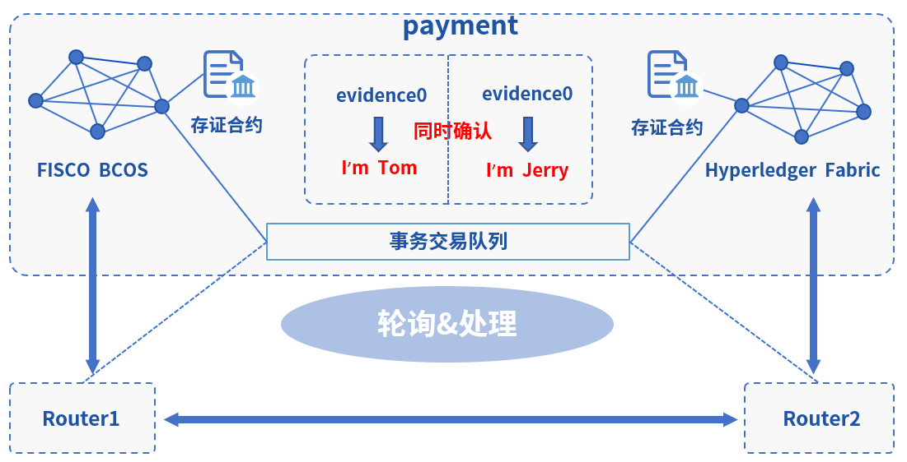

# 跨平台 FISCO BCOS & Fabric

此Demo搭建了一个WeCross跨链网络，连接FISCO BCOS和Hyperledger Fabric区块链。用户可通过WeCross控制台，对不同的链上资源进行操作。


## 网络部署

在已下载的demo目录下进行操作

```bash
cd ~/wecross-demo

#清理旧demo环境
bash clear.sh

# 运行部署脚本，输入数据库账号密码，第一次运行需耗时10-30分钟左右
bash build.sh # 若出错，可用 bash clear.sh 清理后重试
```

```eval_rst
.. note::
    - MacOS用户若出现“无法打开”，“无法验证开发者”的情况，可参考 `FAQ问题3 <../../faq/faq.html#id3>`_ 的方式解决
    - 输入数据库IP时，若"127.0.0.1"无法成功，请尝试输入"localhost"
```

部署成功后会输出Demo的网络架构，FISCO BCOS和Fabric通过各自的WeCross Router相连。（输入Y，回车，进入WeCross控制台）

``` 
[INFO] Success! WeCross demo network is running. Framework:

            FISCO BCOS                    Fabric
           (4node pbft)              (first-network)
          (HelloWorld.sol)              (sacc.go)
                 |                          |
                 |                          |
                 |                          |
          WeCross Router <----------> WeCross Router <----------> WeCross Account Manager
      (127.0.0.1-8250-25500)      (127.0.0.1-8251-25501)             (127.0.0.1:8340)
          /            \
         /              \
        /                \
 WeCross WebApp     WeCross Console
    
Start WeCross Console? [Y/n]
```

## 操作跨链资源

**登录跨链账户**

进入控制台，首先登录跨链账户。（Demo中已配置好一个账户：org1-admin，密码：123456）

``` groovy
[WeCross]> login org1-admin 123456
Result: success
=============================================================================================
Universal Account:
username: org1-admin
pubKey  : 3059301306...
uaID    : 3059301306...
```

**查看账户**

用`listAccount`命令查看此跨链账户下，向不同类型的链发送交易的链账户。

``` gr
[WeCross.org1-admin]> listAccount
Universal Account:
username: org1-admin
pubKey  : 3059301306...
uaID    : 3059301306...
chainAccounts: [
        BCOS2.0 Account:
        keyID    : 0
        type     : BCOS2.0
        address  : 0x07234bd37393a97268f91ee2b7c76cb3ec3601b0
        isDefault: true
        ----------
        Fabric1.4 Account:
        keyID    : 1
        type     : Fabric1.4
        MembershipID : Org1MSP
        isDefault: true
        ----------
        Fabric1.4 Account:
        keyID    : 2
        type     : Fabric1.4
        MembershipID : Org2MSP
        isDefault: false
        ----------
]
```

**查看资源**

用`listResources`命令查看WeCross跨连网络中的所有资源。可看到已经部署了多个资源：

* `payment.bcos.HelloWorld`
  * 对应于FISCO BCOS链上的HelloWorld.sol合约
* `payment.fabric.sacc`
  * 对应于Fabric链上的[sacc.go](https://github.com/hyperledger/fabric-samples/blob/v1.4.4/chaincode/sacc/sacc.go)合约
* `payment.xxxx.WeCrossHub`
  * 每条链默认安装的Hub合约，用于接收链上合约发起的跨链调用，可参考[《合约跨链》](../../dev/interchain.html)

```bash
[WeCross.org1-admin]> listResources
path: payment.bcos.HelloWorld, type: BCOS2.0, distance: 0
path: payment.fabric.WeCrossHub, type: Fabric1.4, distance: 1
path: payment.bcos.WeCrossHub, type: BCOS2.0, distance: 0
path: payment.fabric.sacc, type: Fabric1.4, distance: 1
total: 4
```

**操作资源：payment.bcos.HelloWorld**

- 读资源
  - 命令：`call path 接口名 [参数列表]`
  - 示例：`call payment.bcos.HelloWorld get`
  
```bash
# 调用HelloWorld合约中的get接口
[WeCross.org1-admin]> call payment.bcos.HelloWorld get
Result: [Hello, World!]
```

- 写资源
  - 命令：`sendTransaction path 接口名 [参数列表]`
  - 示例：`sendTransaction payment.bcos.HelloWeCross set Tom`

```bash
# 调用HelloWeCross合约中的set接口
[WeCross.org1-admin]> sendTransaction payment.bcos.HelloWorld set Tom
Txhash  : 0x7043064899fa48b6c3138f545ecf0f8d6f823d45e0783406bc2afe489061c77c
BlockNum: 6
Result  : []     // 将Tom给set进去

[WeCross.org1-admin]> call payment.bcos.HelloWorld get
Result: [Tom]    // 再次get，Tom已set
```

**操作资源：payment.fabric.sacc**

跨链资源是对各个不同链上资源的统一和抽象，因此操作的命令是保持一致的。

- 读资源

```bash
# 调用mycc合约中的query接口
[WeCross.org1-admin]> call payment.fabric.sacc get a
Result: [10] // 初次get，a的值为10
```

- 写资源

```bash
# 调用sacc合约中的set接口
[WeCross.org1-admin]> sendTransaction payment.fabric.sacc set a 666
Txhash  : 85dd6c2c76b959cd5d6d5c60d1f4bc509df4c84a48ef7066f6c66bd59b67c6be
BlockNum: 8
Result  : [666]

[WeCross.org1-admin]> call payment.fabric.sacc get a
Result: [666] // 再次get，a的值变成666

# 退出WeCross控制台
[WeCross.org1-admin]> quit # 若想再次启动控制台，cd至WeCross-Console，执行start.sh即可
```

WeCross Console是基于WeCross Java SDK开发的跨链应用。搭建好跨链网络后，可基于WeCross Java SDK开发更多的跨链应用，通过统一的接口对各种链上的资源进行操作。

## 跨链转账

WeCross支持多种事务机制。此跨链转账的Demo是[哈希时间锁合约(htlc)](../../routine/htlc.html)的举例。WeCross基于其htlc框架实现了**异构链之间资产的原子互换**，如下图所示：


场景描述如下

- BCOS 链
  - 转账金额：700
  - 发送者：org2-admin（bcos链账户：`0x4305196480b029bbecb071b4b68e95dfef36a7b7`）
  - 接收者：org1-admin（bcos链账户：`0x2b5ad5c4795c026514f8317c7a215e218dccd6cf`）
- Fabric 链
  - 转账金额：500
  - 发送者：org1-admin（Fabric链账户：`Admin@org1.example.com`）
  - 接收者：org2-admin（Fabric链账户：`User1@org2.example.com`）
- 哈希锁：`bea2dfec011d830a86d0fbeeb383e622b576bb2c15287b1a86aacdba0a387e11`
  - 解锁秘钥：`9dda9a5e175a919ee98ff0198927b0a765ef96cf917144b589bb8e510e04843c`

* 原子互换：FISCO BCOS链与Fabric链的转账同时发生

**部署哈希时间锁合约**

可通过脚本`htlc_config.sh`完成相关部署，并体验跨链转账。

```bash
# 请确保demo已搭建完毕，并在demo根目录执行，耗时5分钟左右
bash htlc_config.sh
```

跨链转账涉及两条链、两个用户（org1-admin，org2-admin），两条链上的资产转出者各自通过WeCross控制台创建一个[转账提案](../../routine/htlc.html#id4)，之后router会自动完成跨链转账。

**创建转账提案**

跨链转账需在跨链的两端都提交转账提案，提交后，router自动实现跨链转账。

- BCOS链资产转出者（`org2-admin`）提交提案
  - FISCO BCOS 链
    - 转账金额：700
    - 发送者：org2-admin（bcos链账户：`0x4305196480b029bbecb071b4b68e95dfef36a7b7`）
    - 接收者：org1-admin（bcos链账户：`0x2b5ad5c4795c026514f8317c7a215e218dccd6cf`）
  - Fabric 链
    - 转账金额：500
    - 发送者：org1-admin（Fabric链账户：`Admin@org1.example.com`）
    - 接收者：org2-admin（Fabric链账户：`User1@org2.example.com`）
  - 哈希锁：`bea2dfec011d830a86d0fbeeb383e622b576bb2c15287b1a86aacdba0a387e11`
    - 是否是发起方：是
    - 解锁秘钥：`9dda9a5e175a919ee98ff0198927b0a765ef96cf917144b589bb8e510e04843c`

```bash
cd ~/wecross-demo/WeCross-Console
bash start.sh

# 转出者登录
[WeCross]> login org2-admin 123456

# 查看发送方余额
[WeCross.org2-admin]>  call payment.bcos.htlc balanceOf 0x4305196480b029bbecb071b4b68e95dfef36a7b7
Result: [1000000000]

# 查看接收方余额
[WeCross.org2-admin]>  call payment.bcos.htlc balanceOf 0x2b5ad5c4795c026514f8317c7a215e218dccd6cf
Result: [0]

# 创建转账提案
[WeCross.org2-admin]> newHTLCProposal payment.bcos.htlc bea2dfec011d830a86d0fbeeb383e622b576bb2c15287b1a86aacdba0a387e11 9dda9a5e175a919ee98ff0198927b0a765ef96cf917144b589bb8e510e04843c true 0x4305196480b029bbecb071b4b68e95dfef36a7b7 0x2b5ad5c4795c026514f8317c7a215e218dccd6cf 700 2000010000 Admin@org1.example.com User1@org2.example.com 500 2000000000
# 输出
Txhash: 0xc521d7dca1094d53773dc61faec1a95273d8ef2b681c5c50c94cde55263015c7
BlockNum: 11
Result: create a htlc proposal successfully
# 退出当前控制台
[WeCross.org2-admin]> quit 
```

- Fabric链资产转出者（`org1-admin`）提交提案
  - FISCO BCOS 链
    - 转账金额：700
    - 发送者：org2-admin（bcos链账户：`0x4305196480b029bbecb071b4b68e95dfef36a7b7`）
    - 接收者：org1-admin（bcos链账户：`0x2b5ad5c4795c026514f8317c7a215e218dccd6cf`）
  - Fabric 链
    - 转账金额：500
    - 发送者：org1-admin（Fabric链账户：`Admin@org1.example.com`）
    - 接收者：org2-admin（Fabric链账户：`User1@org2.example.com`）
  - 哈希锁：`bea2dfec011d830a86d0fbeeb383e622b576bb2c15287b1a86aacdba0a387e11`
    - 是否是发起方：否
    - 解锁秘钥：空（非发起方无秘钥）

```bash
cd ~/wecross-demo/WeCross-Console
bash start.sh

# 转出者登录
[WeCross]> login org1-admin 123456

# 查看接收方余额
[WeCross.org1-admin]> call payment.fabric.htlc balanceOf User1@org2.example.com
Result: [0]

# 创建转账提案
[WeCross.org1-admin]> newHTLCProposal payment.fabric.htlc  bea2dfec011d830a86d0fbeeb383e622b576bb2c15287b1a86aacdba0a387e11 null false 0x4305196480b029bbecb071b4b68e95dfef36a7b7 0x2b5ad5c4795c026514f8317c7a215e218dccd6cf 700 2000010000 Admin@org1.example.com User1@org2.example.com 500 2000000000
# 输出
Txhash: bbbe3c65a54f883151075129d4666a5ba40896bf75a3be09cfb96ef0354cc55f
BlockNum: 10
Result: create a htlc proposal successfully
# 退出当前控制台
[WeCross]> quit 
```

**跨链资产转移**

当两个资产转出者都创建完提案后，router开始执行调度，并完成跨链转账。一次跨链转账存在5-25s的交易时延，主要取决于两条链以及机器的性能。

**查询转账结果**

在通过WeCross控制台查询资产是否到账。

```bash
cd ~/wecross-demo/WeCross-Console
bash start.sh

# 登录
[WeCross]> login org1-admin 123456

# 查看FISCO BCOS接收方余额，收到700
[WeCross.org1-admin]> call payment.bcos.htlc balanceOf 0x2b5ad5c4795c026514f8317c7a215e218dccd6cf
Result: [700]

# 查看Fabric接收方余额，收到500
[WeCross.org1-admin]> call payment.fabric.htlc balanceOf User1@org2.example.com
Result: [500]

# 退出当前控制台
[WeCross.org1-admin]> quit 
```

## 跨链存证

WeCross支持多种事务机制。此跨链转账的demo是两阶段事务机制（2PC）的举例。WeCross基于其[2PC框架](../../routine/xa.html)实现了**异构链之间证据的同时确认**，如下图所示：



**部署跨链存证demo的合约**

用一键脚本，在FISCO BCOS和Fabric上分别部署存证跨链的两个存证demo合约

``` bash
cd ~/wecross-demo/
bash xa_config_evidence.sh
```

部署成功，输入Y进入控制台

``` 
[INFO] SUCCESS: 2PC evidence example has been deployed to FISCO BCOS and Fabric:

      FISCO BCOS                    Fabric
(payment.bcos.evidence)   (payment.fabric.evidence)
           |                          |
           |                          |
    WeCross Router <----------> WeCross Router
(127.0.0.1-8250-25500)      (127.0.0.1-8251-25501)
           |
           |
    WeCross Console

Start WeCross Console to try? [Y/n]
```

进入控制台，首先登录跨链账户。（Demo中已配置好一个账户：org1-admin，密码：123456）

``` bash
[WeCross]> login org1-admin  123456
Result: success
=============================================================================================
Universal Account:
username: org1-admin
pubKey  : 3059301306...
uaID    : 3059301306...
```

**发起跨链事务（start）**

发起一个跨链事务，指定事务涉及的跨链资源，此处FISCO BCOS和Fabric上各一个资源

* payment.bcos.evidence
* payment.fabric.evidence

``` bash
# 发起事务
[WeCross.org1-admin]> startTransaction payment.bcos.evidence payment.fabric.evidence
Result: success!

# 查看当前存证evidence0的内容
[WeCross.org1-admin]> call payment.bcos.evidence queryEvidence evidence0
Result: [] # 未存入，空

[WeCross.org1-admin]> call payment.fabric.evidence queryEvidence evidence0
Result: [] # 未存入，空
```

**发送事务交易（exec）**

事务开始后，通过execTransaction发送事务交易至向此事务涉及的资源，交易会被缓存入事务交易队列，在下一步commit时让所有交易同时被确认。

``` bash
# 在FISCO BCOS链上进行存证，证据名：evidence0，内容：I'm Tom
[WeCross.org1-admin]> execTransaction payment.bcos.evidence newEvidence evidence0 "I'm Tom"
Txhash  : 0xa5bdd60240622438be1a99b8cca70b6a71aa3cfa444eefac405b22febf6ce4c9
BlockNum: 8
Result  : [true]

# 在Fabric链上进行存证，证据名：evidence0，内容：I'm Jerry
[WeCross.org1-admin]> execTransaction payment.fabric.evidence newEvidence evidence0 "I'm Jerry"
Txhash  : c01809f3cf9154d09fb1a057c743a07dbb0ab2f0c544a9f9d644eb55fb384604
BlockNum: 10
Result  : [Success]

# 可发送更多的操作
```

**确认跨链事务（commit）**

在此事务下缓存了一些列的事务交易后，通过commitTransaction让所有事务交易同时被确认，结束此事务。

``` bash 
# 确认事务，事务结束
[WeCross.org1-admin]> commitTransaction payment.bcos.evidence payment.fabric.evidence
Result: success!

# 查看当前存证内容，两条链都已完成存证
[WeCross.org1-admin]> call payment.bcos.evidence queryEvidence evidence0
Result: [I'm Tom]

[WeCross.org1-admin]> call payment.fabric.evidence queryEvidence evidence0
Result: [I'm Jerry]
```

**回滚跨链事务（rollback）**

在commit前，若不想让事务发生，则用rollbackTransaction回滚此事务，所有缓存的事务交易被丢弃，链上数据回退到事务发起前状态，事务结束。（每个事务要么commit，要么rollback）

``` bash
# 查看当前存证evidence1的内容
[WeCross.org1-admin]> call payment.bcos.evidence queryEvidence evidence1
Result: [] # 未存入，空

[WeCross.org1-admin]> call payment.fabric.evidence queryEvidence evidence1
Result: [] # 未存入，空

# 发起另一个事务，事务号101
[WeCross.org1-admin]> startTransaction payment.bcos.evidence payment.fabric.evidence
Result: success!

# 向FISCO BCOS链发送事务交易，设置evidence1，内容为I'm TomGG
[WeCross.org1-admin]> execTransaction payment.bcos.evidence newEvidence evidence1 "I'm TomGG"
Txhash  : 0x1f81a63a3986702a6c1b532c1d94074f2771a825c3bef1b9dffc73321b45cbe2
BlockNum: 11
Result  : [true]

# 向Fabric链发送事务交易，设置evidence1，内容为I'm JerryMM
[WeCross.org1-admin]> execTransaction payment.fabric.evidence newEvidence evidence1 "I'm JerryMM"
Txhash  : fd18cbecaa3f2528e865ece6ea243c1f18c37e306ee6a59c56407476cce6cc37
BlockNum: 13
Result  : [Success]

# 查看当前事务状态下的数据
[WeCross.org1-admin]> call payment.bcos.evidence queryEvidence evidence1
Result: [I'm TomGG]

# 查看当前事务状态下的数据
[WeCross.org1-admin]> call payment.fabric.evidence queryEvidence evidence1
Result: [I'm JerryMM]

# 尝试发送普通交易修改此事务下的资源，由于此资源处在事务状态中，被锁定，不可修改
[WeCross.org1-admin]> sendTransaction payment.bcos.evidence newEvidence evidence1 "I'm TomDD"
Error: code(2031), message(evidence is locked by unfinished xa transaction: b04a651171644bf591f2047c2a0a79eb)

# 查看当前事务状态下的数据，未变化，普通交易修改失败，符合预期
[WeCross.org1-admin]> call payment.bcos.evidence queryEvidence evidence1
Result: [I'm TomGG]

# 回滚操作！假设此事务不符合预期，需回滚至事务开始前状态，执行如下命令进行回滚，事务结束
[WeCross.org1-admin]> rollbackTransaction payment.bcos.evidence payment.fabric.evidence
Result: success!

# 再次查看当前存证evidence1的内容
[WeCross.org1-admin]> call payment.bcos.evidence queryEvidence evidence1
Result: [] # 已回滚至开始状态

[WeCross.org1-admin]> call payment.fabric.evidence queryEvidence evidence1
Result: [] # 已回滚至开始状态

# 退出当前控制台
[WeCross.org1-admin]> quit 
```

此demo基于[2PC框架](../../routine/xa.html)实现，用户可根据业务需要基于框架开发自己的跨链应用，实现链间的原子操作。

## 访问网页管理台

浏览器访问`router-8250`的网页管理台

``` url
http://localhost:8250/s/index.html#/login
```

用demo已配置账户进行登录：`org1-admin`，密码：`123456`


管理台中包含如下内容，点击链接进入相关操作指导。

* [登录/注册](../../manual/webApp.html#id10)
* [平台首页](../../manual/webApp.html#id11)
* [账户管理](../../manual/webApp.html#id12)
* [路由管理](../../manual/webApp.html#id13)
* [资源管理](../../manual/webApp.html#id14)
* [交易管理](../../manual/webApp.html#id15)
* [事务管理](../../manual/webApp.html#id16)

``` eval_rst
.. note::
    - 若需要远程访问，请修改router的主配置（如：~/demo/routers-payment/127.0.0.1-8250-25500/conf/wecross.toml）， 将 ``[rpc]`` 标签下的 ``address`` 修改为所需ip（如：0.0.0.0）。保存后，重启router即可。
```

## 清理 Demo

为了不影响其它章节的体验，可将搭建的Demo清理掉。

``` bash
cd ~/wecross-demo/
bash clear.sh

mysql -u <your-username> -p # 登录数据库，清理db

mysql> drop database wecross_account_manager;
mysql> exit;
```

至此，恭喜你，快速体验完成！可进入[手动组网](../networks.md)章节深入了解更多细节。

