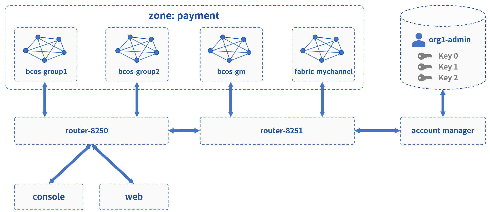
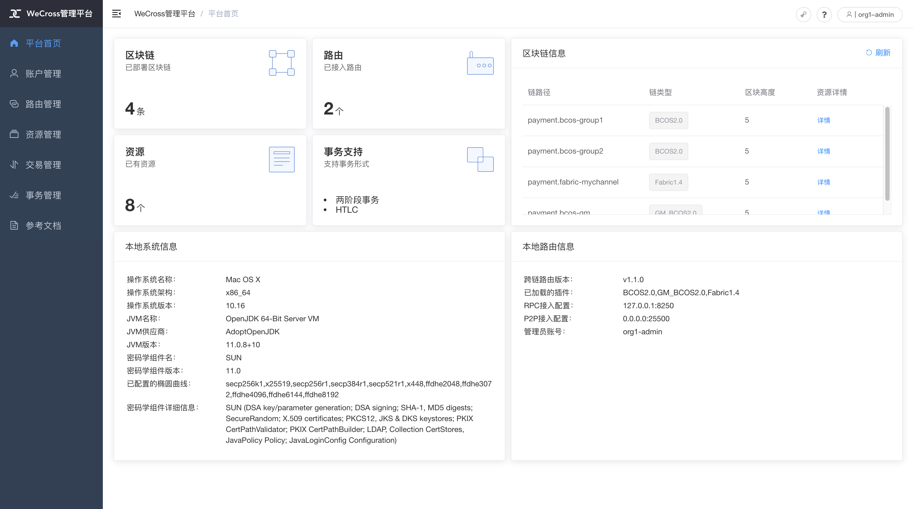

# 混合场景

此Demo搭建了一个WeCross跨链网络，连接以下四条链（群组）：

* Hyperledger Fabric 链：fabric-mychannel
* FISCO BCOS 国密链：bcos-gm
* FISCO BCOS 非国密链群组1：bcos-group1
* FISCO BCOS 非国密链群组2：bcos-group2

搭建后，用户可使用网页管理台和WeCross控制台，对不同的链上资源进行操作。



## 网络部署

在已下载的demo目录下进行操作

```bash
cd ~/wecross-demo

#清理旧demo环境
bash clear.sh

# 运行部署脚本，第一次运行需耗时10-30分钟左右
bash build_cross_all.sh # 若出错，可用 bash clear.sh 清理后重试
```

```eval_rst
.. note::
    - MacOS用户若出现“无法打开”，“无法验证开发者”的情况，可参考 `FAQ问题3 <../../faq/faq.html#id3>`_ 的方式解决
    - 输入数据库IP时，若"127.0.0.1"无法成功，请尝试输入"localhost"
```

部署成功后会输出Demo的网络架构，FISCO BCOS和Fabric通过各自的WeCross Router相连。（输入Y，回车，进入WeCross控制台）

``` 
[INFO] Success! WeCross demo network is running. Framework:

       FISCO BCOS          FISCO BCOS          FISCO BCOS            Fabric
        Group 1             Group 2              Guomi           first-network
   (HelloWorldGroup1)  (HelloWorldGroup2)     (HelloWorld)         (sacc.go)
            \                 /                     \                 /
             \               /                       \               /
              \             /                         \             /
              WeCross  Router  <------------------->  WeCross  Router <----------> WeCross Account Manager
           (127.0.0.1-8250-25500)                  (127.0.0.1-8251-25501)             (127.0.0.1:8340)
              /            \
             /              \
            /                \
     WeCross WebApp     WeCross Console
     
Start WeCross Console? [Y/n]
```

## 控制台操作

**登录跨链账户**

进入控制台，首先登录跨链账户。（Demo中已配置好一个账户：org1-admin，密码：123456）

``` groovy
[WeCross]> login org1-admin 123456
Result: success
=============================================================================================
Universal Account:
username: org1-admin
pubKey  : 3059301306...
uaID    : 3059301306...
```

**查看账户**

用`listAccount`命令查看此跨链账户下，向不同类型的链发送交易的链账户。

```bash
[WeCross.org1-admin]>listAccount
Universal Account:
username: org1-admin
pubKey  : 3059301306...
uaID    : 3059301306...
chainAccounts: [
        BCOS2.0 Account:
        keyID    : 0
        type     : BCOS2.0
        address  : 0x445554f52beb4e85ccb2edbab3a6f4e125eb61b7
        isDefault: true
        ----------
        GM_BCOS2.0 Account:
        keyID    : 4
        type     : GM_BCOS2.0
        address  : 0x4fef3c35a60490d1f01b2e749c17ea83c7c6611e
        isDefault: true
        ----------
        Fabric1.4 Account:
        keyID    : 1
        type     : Fabric1.4
        MembershipID : Org1MSP
        isDefault: true
        ----------
        Fabric1.4 Account:
        keyID    : 3
        type     : Fabric1.4
        MembershipID : Org1MSP
        isDefault: false
        ----------
        Fabric1.4 Account:
        keyID    : 2
        type     : Fabric1.4
        MembershipID : Org2MSP
        isDefault: false
        ----------
]
```

**查看资源**

用`listResources`命令查看WeCross跨连网络中的所有资源。可看到有多个跨链资源：

* `payment.bcos-group1.HelloWorldGroup1`
  * bcos-group1链上的HelloWorld.sol合约
* `payment.bcos-group2.HelloWorldGroup2`
  * bcos-group2链上的HelloWorld.sol合约
* `payment.bcos-gm.HelloWorld`
  * 对应于国密FISCO BCOS链上的HelloWorld.sol合约
* `payment.fabric-mychannel.sacc`
  * 对应于Fabric链上的[sacc.go](https://github.com/hyperledger/fabric-samples/blob/v1.4.4/chaincode/sacc/sacc.go)合约
* `payment.xxxx.WeCrossHub`
  * 每条链默认安装的Hub合约，用于接收链上合约发起的跨链调用，可参考[《合约跨链》](../../dev/interchain.html)

```bash
path: payment.bcos-group2.HelloWorldGroup2, type: BCOS2.0, distance: 0
path: payment.bcos-group2.WeCrossHub, type: BCOS2.0, distance: 0
path: payment.bcos-group1.HelloWorldGroup1, type: BCOS2.0, distance: 0
path: payment.bcos-group1.WeCrossHub, type: BCOS2.0, distance: 0
path: payment.fabric-mychannel.WeCrossHub, type: Fabric1.4, distance: 1
path: payment.bcos-gm.WeCrossHub, type: GM_BCOS2.0, distance: 1
path: payment.bcos-gm.HelloWorld, type: GM_BCOS2.0, distance: 1
path: payment.fabric-mychannel.sacc, type: Fabric1.4, distance: 1
total: 8
```

**操作资源**

本demo涉及资源较多，可在[其他demo](./index.html)体验。请直接访问网页管理台，更直观的操作跨链资源。

``` bash
# 退出当前控制台
[WeCross.org1-admin]> quit 
```

## 访问网页管理台

浏览器访问`router-8250`的网页管理台

``` url
http://localhost:8250/s/index.html#/login
```

用demo已配置账户进行登录：`org1-admin`，密码：`123456`



管理台中包含如下内容，点击链接进入相关操作指导。

* [登录/注册](../../manual/webApp.html#id10)
* [平台首页](../../manual/webApp.html#id11)
* [账户管理](../../manual/webApp.html#id12)
* [路由管理](../../manual/webApp.html#id13)
* [资源管理](../../manual/webApp.html#id14)
* [交易管理](../../manual/webApp.html#id15)
* [事务管理](../../manual/webApp.html#id16)

``` eval_rst
.. note::
    - 若需要远程访问，请修改router的主配置（如：~/demo/routers-payment/127.0.0.1-8250-25500/conf/wecross.toml）， 将 ``[rpc]`` 标签下的 ``address`` 修改为所需ip（如：0.0.0.0）。保存后，重启router即可。
```

## 清理 Demo

为了不影响其它章节的体验，可将搭建的Demo清理掉。

``` bash
cd ~/wecross-demo/
bash clear.sh

mysql -u <your-username> -p # 登录数据库，清理db

mysql> drop database wecross_account_manager;
mysql> exit;
```

至此，恭喜你，快速体验完成！可进一步操作，体验其他Demo。

