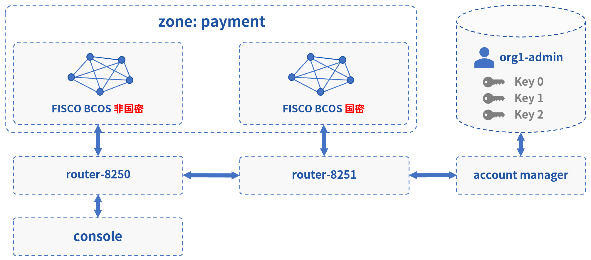

# 跨国密、非国密

此Demo搭建了一个WeCross跨链网络，连接FISCO BCOS的国密区块链和非国密区块链。用户可通过WeCross控制台，对不同链的链上资源进行操作。实际情况下，WeCross接入链的场景不受限制，用户可配置接入多条各种类型的区块链。



## 网络部署

在已下载的demo目录下进行操作

```bash
cd ~/demo

#清理旧demo环境
bash clear.sh

# 运行部署脚本，第一次运行需耗时10-30分钟左右
bash build_cross_gm.sh # 若出错，可用 bash clear.sh 清理后重试
```

```eval_rst
.. note::
    - MacOS用户若出现“无法打开”，“无法验证开发者”的情况，可参考 `FAQ问题3 <../../faq/faq.html#id3>`_ 的方式解决
```

部署成功后会输出Demo的网络架构，FISCO BCOS和Fabric通过各自的WeCross Router相连。（输入Y，回车，进入WeCross控制台）

``` 
[INFO] Success! WeCross demo network is running. Framework:

                    FISCO BCOS
         Normal                     Guomi
      (HelloWorld)               (HelloWorld)
           |                          |
           |                          |
    WeCross Router <----------> WeCross Router
(127.0.0.1-8250-25500)      (127.0.0.1-8251-25501)
           |
           |
    WeCross Console
    
Start console? [Y/n]
```

## 操作跨链资源

**查看资源**

进入控制台，用`listResources`命令查看WeCross跨连网络中的所有资源。可看到有两个资源：

* payment.bcos.HelloWorld
  * 对应于**非国密FISCO BCOS链**上的HelloWorld.sol合约
* payment.bcos_gm.HelloWorld
  * 对应于**国密FISCO BCOS链**上的HelloWorld.sol合约

```bash
[WeCross]> listResources
path: payment.bcos.HelloWorld, type: BCOS2.0, distance: 0
path: payment.bcos_gm.HelloWorld, type: GM_BCOS2.0, distance: 1
total: 2
```

**查看账户**

用`listAccounts`命令查看WeCross Router上已存在的账户，操作资源时用相应账户进行操作。

```bash
[WeCross]> listAccounts
name: bcos_user1, type: BCOS2.0
name: bcos_gm_user1, type: GM_BCOS2.0
total: 2
```

**操作资源：payment.bcos.HelloWorld**

- 读资源
  - 命令：`call path 账户名 接口名 [参数列表]`
  - 示例：`call payment.bcos.HelloWorld bcos_user1 get`

```bash
# 调用非国密链上HelloWorld合约中的get接口
[WeCross]> call payment.bcos.HelloWorld bcos_user1 get
Result: [Hello, World!] // 初次get，值为Hello World!
```

- 写资源
  - 命令：`sendTransaction path 账户名 接口名 [参数列表]`
  - 示例：`sendTransaction payment.bcos.HelloWorld bcos_user1 set Tom`

```bash
# 调用非国密链上HelloWeCross合约中的set接口
[WeCross]> sendTransaction payment.bcos.HelloWorld bcos_user1 set Tom
Txhash  : 0x5a70d7874c2f0e4a9eddf160db6d2a79b923afeb9fa95bdea368391079176b6b
BlockNum: 5
Result  : []     // 将Tom给set进去

[WeCross]> call payment.bcos.HelloWorld bcos_user1 get
Result: [Tom]    // 再次get，Tom已set
```

**操作资源：payment.bcos_gm.HelloWorld**

跨链资源是对各个不同链上资源的统一和抽象，因此操作的命令是保持一致的。

- 读资源

```bash
# 调用国密链上HelloWorld合约中的get接口
[WeCross]> call payment.bcos_gm.HelloWorld bcos_gm_user1 get
Result: [Hello, World!] // 初次get，值为Hello World!
```

- 写资源

```bash
# 调用国密链上HelloWeCross合约中的set接口
[WeCross]> sendTransaction payment.bcos_gm.HelloWorld bcos_gm_user1 set Jerry
Txhash  : 0xe74f237d6ad30e30755bb007bf543b6909238c65d72d4d5b62e29db6cd484aec
BlockNum: 5
Result  : []     // 将Jerry给set进去

[WeCross]> call payment.bcos_gm.HelloWorld bcos_gm_user1 get
Result: [Jerry]    // 再次get，Jerry已set

# 检查非国密链上的资源，不会因为国密链上的资源被修改而改变
[WeCross]> call payment.bcos.HelloWorld bcos_user1 get
Result: [Tom]

# 退出WeCross控制台
[WeCross]> quit # 若想再次启动控制台，cd至WeCross-Console，执行start.sh即可
```

WeCross Console是基于WeCross Java SDK开发的跨链应用。搭建好跨链网络后，可基于WeCross Java SDK开发更多的跨链应用，通过统一的接口对各种链上的资源进行操作。

## 清理 Demo

为了不影响其它章节的体验，可将搭建的Demo清理掉。

``` bash
cd ~/demo/
bash clear.sh
```

至此，恭喜你，快速体验完成！可进入[手动组网](../networks.md)章节深入了解更多细节。

