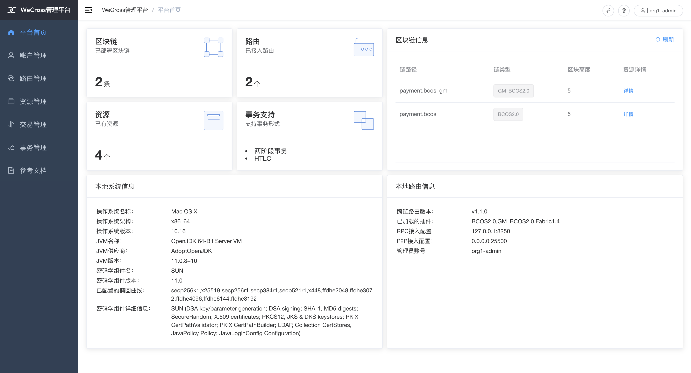

# 跨国密、非国密

此Demo搭建了一个WeCross跨链网络，连接FISCO BCOS的国密区块链和非国密区块链。用户可通过WeCross控制台，对不同链的链上资源进行操作。实际情况下，WeCross接入链的场景不受限制，用户可配置接入多条各种类型的区块链。


## 网络部署

在已下载的demo目录下进行操作

```bash
cd ~/wecross-demo

#清理旧demo环境
bash clear.sh

# 运行部署脚本，输入数据库账号密码，第一次运行需耗时10-30分钟左右
bash build_cross_gm.sh # 若出错，可用 bash clear.sh 清理后重试

# Tips: 可选用配置MySQl参数，进行无交互式部署, 详情请参考下述脚本输出
bash build_cross_gm.sh -h

Create a wecross demo with bcos and bcos_guomi chains.
Usage:
    -d                  [Optional] Use default db configuration: -H 127.0.0.1 -P 3306 -u root -p 123456
    -H                  [Optional] DB ip
    -P                  [Optional] DB port
    -u                  [Optional] DB username
    -p                  [Optional] DB password
    -h  call for help
e.g
    bash build_cross_gm.sh -H 127.0.0.1 -P 3306 -u root -p 123456
    bash build_cross_gm.sh
```

```bash
# 可选的，可通过修改脚本配置，选择指定版本的demo进行部署，默认为最新版本
vim profile_version.sh

# WeCross
WECROSS_VERSION=v1.1.0
# WeCross Console
WECROSS_CONSOLE_VERSION=v1.1.0
# WeCross Account Manager
WECROSS_ACCOUNT_MANAGER_VERSION=v1.1.0
# WeCross BCOS2.0 Stub
WECROSS_BCOS2_STUB_VERSION=v1.1.0
# WeCross Fabric1.4 Stub
WECROSS_FABRIC1_STUB_VERSION=v1.1.0
# WeCross Fabric2.0 Stub
WECROSS_FABRIC2_STUB_VERSION=v2.0.0
# WeCross Java SDK
WECROSS_JAVA_SDK_VERSION=v1.1.0

# FISCO BCOS
BCOS_VERSION=v2.7.1
# FISCO BCOS Console
BCOS_CONSOLE_VERSION=v1.0.10
```

```eval_rst
.. important::
    - 若出现“command not found”， 则说明缺少依赖，请参考 `环境要求 <../env.html#id4>`_ 安装相关依赖
    - macOS用户若出现“无法打开”，“无法验证开发者”的情况，可参考 `FAQ问题3 <../../faq/faq.html#id3>`_ 的方式解决
    - 输入数据库IP时，若"127.0.0.1"无法成功，请尝试输入"localhost"
    - 若出现其它问题，请参考常见问题说明 `FAQ <../../faq/faq.html#>`_
```

部署成功后会输出Demo的网络架构，FISCO BCOS和Fabric通过各自的WeCross Router相连。（输入Y，回车，进入WeCross控制台）

```bash
[INFO] Success! WeCross demo network is running. Framework:

                          FISCO BCOS
               Normal                     Guomi
            (HelloWorld)               (HelloWorld)
                 |                          |
                 |                          |
                 |                          |
          WeCross Router <----------> WeCross Router <----------> WeCross Account Manager
      (127.0.0.1-8250-25500)      (127.0.0.1-8251-25501)             (127.0.0.1:8340)
          /            \
         /              \
        /                \
 WeCross WebApp     WeCross Console
    
Start console? [Y/n]
```

## 操作跨链资源

**登录跨链账户**

进入控制台，首先登录跨链账户。（Demo中已配置好一个账户：org1-admin，密码：123456）

``` groovy
[WeCross]> login org1-admin 123456
Result: success
=============================================================================================
Universal Account:
username: org1-admin
pubKey  : 3059301306...
uaID    : 3059301306...
```

**查看账户**

用`listAccount`命令查看此跨链账户下，向不同类型的链发送交易的链账户。

``` gr
[WeCross.org1-admin]> listAccount
Universal Account:
username: org1-admin
pubKey  : 3059301306...
uaID    : 3059301306...
chainAccounts: [
        BCOS2.0 Account:
        keyID    : 0
        type     : BCOS2.0
        address  : 0x8120dde72685b1ac07d0c20d0069696e42ace1db
        isDefault: true
        ----------
        GM_BCOS2.0 Account:
        keyID    : 1
        type     : GM_BCOS2.0
        address  : 0x0e5c45e9431578fd8ac114781c6d61a2ad4946e5
        isDefault: true
        ----------
]
```

**查看资源**

用`listResources`命令查看WeCross跨连网络中的所有资源。可看到有多个资源：

* `payment.bcos.HelloWorld`
  * 对应于**非国密FISCO BCOS链**上的HelloWorld.sol合约
* `payment.bcos_gm.HelloWorld`
  * 对应于**国密FISCO BCOS链**上的HelloWorld.sol合约
* `payment.xxxx.WeCrossHub`
  * 每条链默认安装的Hub合约，用于接收链上合约发起的跨链调用，可参考[《合约跨链》](../../dev/interchain.html)

```bash
[WeCross.org1-admin]> listResources
path: payment.bcos.HelloWorld, type: BCOS2.0, distance: 0
path: payment.bcos_gm.HelloWorld, type: GM_BCOS2.0, distance: 1
path: payment.bcos.WeCrossHub, type: BCOS2.0, distance: 0
path: payment.bcos_gm.WeCrossHub, type: GM_BCOS2.0, distance: 1
total: 4
```

**操作资源：payment.bcos.HelloWorld**

- 读资源
  - 命令：`call path 接口名 [参数列表]`
  - 示例：`call payment.bcos.HelloWorld get`

```bash
# 调用非国密链上HelloWorld合约中的get接口
[WeCross.org1-admin]> call payment.bcos.HelloWorld get
Result: [Hello, World!] // 初次get，值为Hello World!
```

- 写资源
  - 命令：`sendTransaction path 接口名 [参数列表]`
  - 示例：`sendTransaction payment.bcos.HelloWorld set Tom`

```bash
# 调用非国密链上HelloWeCross合约中的set接口
[WeCross.org1-admin]> sendTransaction payment.bcos.HelloWorld set Tom
Txhash  : 0x4b2d6a5f2365318b6574a02fba2df1f4cdba8e581513c8588033f7b793afc061
BlockNum: 6
Result  : []     // 将Tom给set进去

[WeCross.org1-admin]> call payment.bcos.HelloWorld get
Result: [Tom]    // 再次get，Tom已set
```

**操作资源：payment.bcos_gm.HelloWorld**

跨链资源是对各个不同链上资源的统一和抽象，因此操作的命令是保持一致的。

- 读资源

```bash
# 调用国密链上HelloWorld合约中的get接口
[WeCross.org1-admin]> call payment.bcos_gm.HelloWorld get
Result: [Hello, World!] // 初次get，值为Hello World!
```

- 写资源

```bash
# 调用国密链上HelloWeCross合约中的set接口
[WeCross.org1-admin]> sendTransaction payment.bcos_gm.HelloWorld set Jerry
Txhash  : 0x95d54faaca7499b5cb19e7af0dafc4965676c3b136809e5957c50d8ca07ed408
BlockNum: 6
Result  : []     // 将Jerry给set进去

[WeCross.org1-admin]> call payment.bcos_gm.HelloWorld get
Result: [Jerry]    // 再次get，Jerry已set

# 检查非国密链上的资源，不会因为国密链上的资源被修改而改变
[WeCross.org1-admin]> call payment.bcos.HelloWorld get
Result: [Tom]

# 退出WeCross控制台
[WeCross.org1-admin]> quit # 若想再次启动控制台，cd至WeCross-Console，执行start.sh即可
```

WeCross Console是基于WeCross Java SDK开发的跨链应用。搭建好跨链网络后，可基于WeCross Java SDK开发更多的跨链应用，通过统一的接口对各种链上的资源进行操作。

## 访问网页管理平台

浏览器访问`router-8250`的网页管理平台

``` url
http://localhost:8250/s/index.html#/login
```

用demo已配置账户进行登录：`org1-admin`，密码：`123456`



管理台中包含如下内容，点击链接进入相关操作指导。

* [登录/注册](../../manual/webApp.html#id10)
* [平台首页](../../manual/webApp.html#id11)
* [账户管理](../../manual/webApp.html#id12)
* [路由管理](../../manual/webApp.html#id13)
* [资源管理](../../manual/webApp.html#id14)
* [交易管理](../../manual/webApp.html#id15)
* [事务管理](../../manual/webApp.html#id16)

``` eval_rst
.. note::
    - 若需要远程访问，请修改router的主配置（如：~/demo/routers-payment/127.0.0.1-8250-25500/conf/wecross.toml）， 将 ``[rpc]`` 标签下的 ``address`` 修改为所需ip（如：0.0.0.0）。保存后，重启router即可。
```

## 清理 Demo

为了不影响其它章节的体验，可将搭建的Demo清理掉。

``` bash
cd ~/wecross-demo/
bash clear.sh

# 可使用脚本drop_account_database.sh删除MySQL中demo使用的数据库
bash drop_account_database.sh

# Tips: 可选用配置MySQl参数，进行无交互式部署, 详情请参考下述脚本输出
bash drop_account_database.sh -h

Create a wecross demo with bcos and fabric chains.
Usage:
    -d                  [Optional] Use default db configuration: -H 127.0.0.1 -P 3306 -u root -p 123456
    -H                  [Optional] DB ip
    -P                  [Optional] DB port
    -u                  [Optional] DB username
    -p                  [Optional] DB password
    -h  call for help
e.g
    bash build.sh -H 127.0.0.1 -P 3306 -u root -p 123456
    bash build.sh
```

至此，恭喜你，快速体验完成！可进入[手动组网](../networks.md)章节深入了解更多细节。
