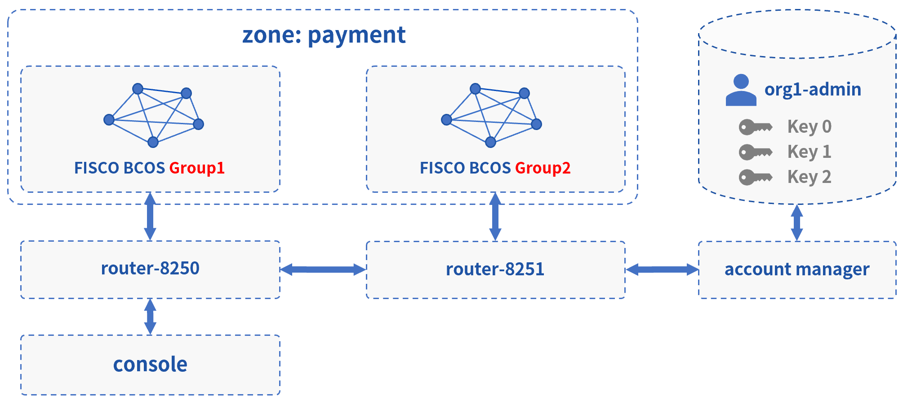
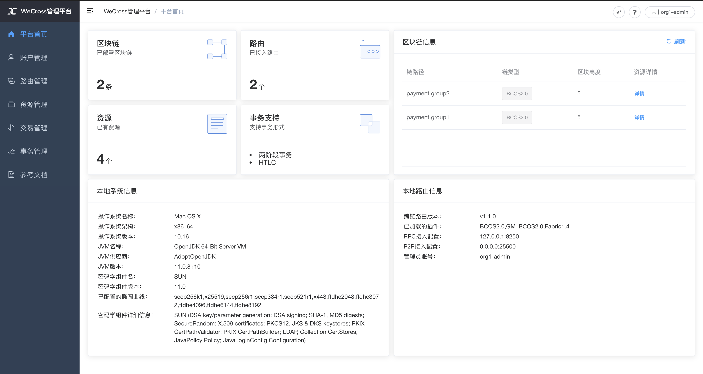

# 跨多群组

此Demo搭建了一个WeCross跨链网络，连接FISCO BCOS中的两个群组。用户可通过WeCross控制台，对不同群组的资源进行操作。实际情况下，WeCross接入链的场景不受限制，用户可配置接入多条各种类型的区块链。



## 网络部署

在已下载的demo目录下进行操作

```bash
cd ~/wecross-demo

#清理旧demo环境
bash clear.sh

# 运行部署脚本，输入数据库账号密码，第一次运行需耗时10-30分钟左右
bash build_cross_groups.sh # 若出错，可用 bash clear.sh 清理后重试
```

```eval_rst
.. note::
    - MacOS用户若出现“无法打开”，“无法验证开发者”的情况，可参考 `FAQ问题3 <../../faq/faq.html#id3>`_ 的方式解决
    - 输入数据库IP时，若"127.0.0.1"无法成功，请尝试输入"localhost"
```

部署成功后会输出Demo的网络架构，FISCO BCOS和Fabric通过各自的WeCross Router相连。（输入Y，回车，进入WeCross控制台）

``` 
[INFO] Success! WeCross demo network is running. Framework:

                          FISCO BCOS
              Group 1                    Group 2
         (HelloWorldGroup1)         (HelloWorldGroup2)
                 |                          |
                 |                          |
                 |                          |
          WeCross Router <----------> WeCross Router <----------> WeCross Account Manager
      (127.0.0.1-8250-25500)      (127.0.0.1-8251-25501)             (127.0.0.1:8340)
          /            \
         /              \
        /                \
 WeCross WebApp     WeCross Console
    
Start console? [Y/n]
```

## 操作跨链资源

**登录跨链账户**

进入控制台，首先登录跨链账户。（Demo中已配置好一个账户：org1-admin，密码：123456）

``` groovy
[WeCross]> login org1-admin 123456
Result: success
=============================================================================================
Universal Account:
username: org1-admin
pubKey  : 3059301306...
uaID    : 3059301306...
```

**查看账户**

用`listAccount`命令查看此跨链账户下，向不同类型的链发送交易的链账户。

``` gr
[WeCross.org1-admin]>listAccount
Universal Account:
username: org1-admin
pubKey  : 3059301306...
uaID    : 3059301306...
chainAccounts: [
        BCOS2.0 Account:
        keyID    : 0
        type     : BCOS2.0
        address  : 0x64a0494c16c4bd6d7e3bb0cf0b9bd6949b65500d
        isDefault: true
        ----------
]
```

**查看资源**

用`listResources`命令查看WeCross跨连网络中的所有资源。可看到有多个资源：

* `payment.group1.HelloWorldGroup1`
  * 对应于Group1上的HelloWorld.sol合约
* `payment.group2.HelloWorldGroup2`
  * 对应于Group2上的HelloWorld.sol合约
* `payment.xxxx.WeCrossHub`
  * 每条链默认安装的Hub合约，用于接收链上合约发起的跨链调用，可参考[《合约跨链》](../../dev/interchain.html)

```bash
[WeCross.org1-admin]>listResources
path: payment.group2.WeCrossHub, type: BCOS2.0, distance: 1
path: payment.group1.WeCrossHub, type: BCOS2.0, distance: 0
path: payment.group2.HelloWorldGroup2, type: BCOS2.0, distance: 1
path: payment.group1.HelloWorldGroup1, type: BCOS2.0, distance: 0
total: 4
```

**操作资源：payment.group1.HelloWorldGroup1**

- 读资源
  - 命令：`call path 接口名 [参数列表]`
  - 示例：`call payment.group1.HelloWorldGroup1 get`
  
```bash
# 调用Group1 HelloWorld合约中的get接口
[WeCross.org1-admin]>call payment.group1.HelloWorldGroup1 get
Result: [Hello, World!] // 初次get，值为Hello World!
```

- 写资源
  - 命令：`sendTransaction path 接口名 [参数列表]`
  - 示例：`sendTransaction payment.group1.HelloWorldGroup1 set Tom`

```bash
# 调用Group1 HelloWeCross合约中的set接口
[WeCross.org1-admin]> sendTransaction payment.group1.HelloWorldGroup1 set Tom
Txhash  : 0xd510203ce12b0ca8c9bceca50dfd4702f64efc2e147aa334a6cfff7988ada686
BlockNum: 6
Result  : []     // 将Tom给set进去

[WeCross.org1-admin]> call payment.group1.HelloWorldGroup1 get
Result: [Tom]    // 再次get，Tom已set
```

**操作资源：payment.group2.HelloWorldGroup2**

跨链资源是对各个不同链上资源的统一和抽象，因此操作的命令是保持一致的。

- 读资源

```bash
# 调用Group2 HelloWorld合约中的get接口
[WeCross.org1-admin]> call payment.group2.HelloWorldGroup2 get
Result: [Hello, World!] // 初次get，值为Hello World!
```

- 写资源

```bash
# 调用Group2 HelloWeCross合约中的set接口
[WeCross.org1-admin]> sendTransaction payment.group2.HelloWorldGroup2 set Jerry
Txhash  : 0xf5a52604750dd4a8b10df69f238815378db9444fef365e102d1a5a43603f18d0
BlockNum: 6
Result  : []     // 将Jerry给set进去

[WeCross.org1-admin]> call payment.group2.HelloWorldGroup2 get
Result: [Jerry]    // 再次get，Jerry已set

# 检查Group1资源，不会因为Group2的资源被修改而改变
[WeCross.org1-admin]> call payment.group1.HelloWorldGroup1 get
Result: [Tom]

# 退出WeCross控制台
[WeCross.org1-admin]> quit # 若想再次启动控制台，cd至WeCross-Console，执行start.sh即可
```

WeCross Console是基于WeCross Java SDK开发的跨链应用。搭建好跨链网络后，可基于WeCross Java SDK开发更多的跨链应用，通过统一的接口对各种链上的资源进行操作。

## 访问网页管理台

浏览器访问`router-8250`的网页管理台

``` url
http://localhost:8250/s/index.html#/login
```

用demo已配置账户进行登录：`org1-admin`，密码：`123456`



管理台中包含如下内容，点击链接进入相关操作指导。

* [登录/注册](../../manual/webApp.html#id10)
* [平台首页](../../manual/webApp.html#id11)
* [账户管理](../../manual/webApp.html#id12)
* [路由管理](../../manual/webApp.html#id13)
* [资源管理](../../manual/webApp.html#id14)
* [交易管理](../../manual/webApp.html#id15)
* [事务管理](../../manual/webApp.html#id16)

``` eval_rst
.. note::
    - 若需要远程访问，请修改router的主配置（如：~/demo/routers-payment/127.0.0.1-8250-25500/conf/wecross.toml）， 将 ``[rpc]`` 标签下的 ``address`` 修改为所需ip（如：0.0.0.0）。保存后，重启router即可。
```

## 清理 Demo

为了不影响其它章节的体验，可将搭建的Demo清理掉。

``` bash
cd ~/wecross-demo/
bash clear.sh

mysql -u <your-username> -p # 登录数据库，清理db

mysql> drop database wecross_account_manager;
mysql> exit;
```

至此，恭喜你，快速体验完成！可进入[手动组网](../networks.md)章节深入了解更多细节。

