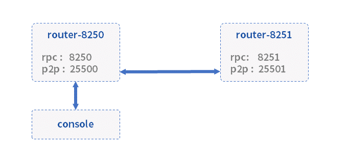

# 基础组件部署

本章节指导完成以下组件的部署，完成WeCross基础网络的搭建。

* **[跨链路由](../../introduction/introduction.html#id2)（router）**：与区块链节点对接，并彼此互连，形成[跨链分区](../../introduction/introduction.html#id2)，负责跨链请求的转发
* **账户服务（account manager）**：为跨链系统提供账户管理
* **跨链控制台（console）**：查询和发送交易的操作终端



进入操作目录：

``` bash
cd ~/wecross-networks
```

## 下载WeCross

下载WeCross，用WeCross中的工具生成跨链路由，并启动跨链路由。

WeCross中包含了生成跨链路由的工具，执行以下命令进行下载（提供[三种下载方式](../../version/download.html#wecross)，可根据网络环境选择合适的方式进行下载），程序下载至`~/wecross-networks/WeCross/`中。

```bash
bash <(curl -sL https://github.com/WeBankBlockchain/WeCross/releases/download/resources/download_wecross.sh)

# 若出现长时间下载WeCross包失败，请尝试以下命令重新下载：
bash <(curl -sL https://gitee.com/WeBank/WeCross/raw/master/scripts/download_wecross.sh)
```

## 部署跨链路由

本例将构建两个跨链路由。首先创建一个`ipfile`配置文件，将需要构建的两个跨链路由信息（`ip:rpc_port:p2p_port`）按行分隔，保存到文件中。

**注**：请确保机器的`8250`，`8251`, `25500`，`25501`端口没有被占用。

```bash
cd ~/wecross-networks
vim ipfile

# 在文件中键入以下内容
127.0.0.1:8250:25500
127.0.0.1:8251:25501
```

生成好`ipfile`文件后，使用脚本[build_wecross.sh](../../manual/scripts.html#wecross)生成两个跨链路由。

```bash
# -f 表示以文件为输入
bash ./WeCross/build_wecross.sh -n payment -o routers-payment -f ../ipfile

# 成功输出如下信息
[INFO] Create routers-payment/127.0.0.1-8250-25500 successfully
[INFO] Create routers-payment/127.0.0.1-8251-25501 successfully
[INFO] All completed. WeCross routers are generated in: routers-payment/
```

```eval_rst
.. note::
    - -n 指定跨链分区标识符(zone id)，跨链分区通过zone id进行区分，可以理解为业务名称。
    - -o 指定输出的目录，并在该目录下生成一个跨链路由。
    - -f 指定需要生成的WeCross跨链路由的列表，包括ip地址，rpc端口，p2p端口，生成后的router已完成互联配置。
```

在routers-payment目录下生成了两个跨链路由。

``` bash
tree routers-payment/ -L 1
routers-payment/
├── 127.0.0.1-8251-25501
├── 127.0.0.1-8252-25502
└── cert
```

生成的跨链路由目录内容如下，以`127.0.0.1-8250-25500`为例。

```bash
# 已屏蔽lib和pages目录，该目录存放所有依赖的jar包
tree routers-payment/127.0.0.1-8250-25500/
routers-payment/127.0.0.1-8250-25500/
├── add_chain.sh      # 区块链配置文件创建脚本
├── apps
│   └── WeCross.jar   # WeCross路由jar包
├── build_wecross.sh
├── conf              # 配置文件目录
│   ├── accounts      # 账户配置目录
│   ├── application.properties 
│   ├── chains        # 区块链配置目录，要接入不同的链，在此目录下进行配置
│   ├── log4j2.xml    
│   ├── ca.crt        # 根证书
│   ├── ssl.crt       # 跨链路由证书
│   ├── ssl.key       # 跨链路由私钥
│   ├── node.nodeid   # 跨链路由nodeid
│   └── wecross.toml  # WeCross Router主配置文件
├── create_cert.sh    # 证书生成脚本
├── download_wecross.sh
├── pages             # 网页管理平台页面文件
├── plugin            # 插件目录，接入相应类型链的插件
│   ├── bcos-stub-gm.jar
│   ├── bcos-stub.jar
│   └── fabric-stub.jar
├── start.sh          # 启动脚本
└── stop.sh           # 停止脚本
```

## 部署账户服务

- 下载

执行过程中需输入相应数据库的配置。


``` bash
cd ~/wecross-networks
bash <(curl -sL https://github.com/WeBankBlockchain/WeCross/releases/download/resources/download_account_manager.sh)

# 若出现长时间下载WeCross-Account-Manager包失败，请尝试以下命令重新下载：
bash <(curl -sL https://gitee.com/WeBank/WeCross/raw/master/scripts/download_account_manager.sh)
```

- 拷贝证书

``` bash
cd ~/wecross-networks/WeCross-Account-Manager/
cp ~/wecross-networks/routers-payment/cert/sdk/* conf/
```

- 生成私钥

``` bash
bash create_rsa_keypair.sh -d conf/
```

- 配置

``` bash
cp conf/application-sample.toml conf/application.toml
vim conf/application.toml
```

需配置内容包括：

``admin``：配置admin账户，此处可默认，router中的admin账户需与此处对应，用于登录账户服务

``db``：配置自己的数据库账号密码

``` toml
[service]
    address = '0.0.0.0'
    port = 8340
    sslKey = 'classpath:ssl.key'
    sslCert = 'classpath:ssl.crt'
    caCert = 'classpath:ca.crt'
    sslOn = true

[admin] 
    # admin账户配置，第一次启动时写入db，之后作为启动校验字段
    name = 'org1-admin' # admin账户名
    password = '123456' # 密码

[auth]
    # for issuring token
    name = 'org1'
    expires = 18000 # 5 h
    noActiveExpires = 600 # 10 min

[db]
    # for connect database
    url = 'jdbc:mysql://localhost:3306/wecross_account_manager'
    username = 'root' # 配置数据库账户
    password = '123456' # 配置数据库密码，不支接受空密码
[ext]
    # for image auth code, allow image auth token empty
    allowImageAuthCodeEmpty = true
```

- 启动

``` bash
bash start.sh
```

## 启动跨链路由

```bash
# 启动 router-8250
cd ~/wecross-networks/routers-payment/127.0.0.1-8250-25500/
bash start.sh

# 启动 router-8251
cd ~/wecross-networks/routers-payment/127.0.0.1-8251-25501/
bash start.sh
```

启动成功，输出如下：

```
WeCross booting up .........
WeCross start successfully
```

如果启动失败，检查`8250, 25500`端口是否被占用。

``` bash
netstat -napl | grep 8250
netstat -napl | grep 25500
netstat -napl | grep 8251
netstat -napl | grep 25501
```

## 部署控制台

WeCross提供了控制台，方便用户进行跨链开发和调试。可通过脚本`build_console.sh`搭建控制台。

- 下载

执行如下命令进行下载（提供[三种下载方式](../../version/download.html#id2)，可根据网络环境选择合适的方式进行下载），下载完成后在当前目录下生成`WeCross-Console`目录。

```bash
cd ~/wecross-networks
bash <(curl -sL https://github.com/WeBankBlockchain/WeCross/releases/download/resources/download_console.sh)

# 若出现长时间下载WeCross-Console包失败，请尝试以下命令重新下载：
bash <(curl -sL https://gitee.com/WeBank/WeCross/raw/master/scripts/download_console.sh)
```

- 配置

```bash
cd ~/wecross-networks/WeCross-Console

# 拷贝连接router所需的TLS证书，从生成的routers-payment/cert/sdk目录下拷贝
cp ~/wecross-networks/routers-payment/cert/sdk/* conf/ 

# 拷贝配置文件，并配置跨链路由RPC服务地址以及端口。此处采用默认配置，默认连接至本地8250端口。
cp conf/application-sample.toml conf/application.toml
```

```eval_rst
.. important::
    - 若搭建WeCross的IP和端口未使用默认配置，需自行更改WeCross-Console/conf/application.toml，详见 `控制台配置 <../../manual/console.html#id12>`_。
```

- 启动

```bash
bash start.sh
```

启动成功则输出如下信息，通过`help`可查看控制台帮助。

```bash
=================================================================================
Welcome to WeCross console(v1.1.0)!
Type 'help' or 'h' for help. Type 'quit' or 'q' to quit console.
=================================================================================
```

- 测试功能

```bash
# 正常进入，可先退出控制台，等待后续配置
[WeCross]> quit
```

更多控制台命令及含义详见[控制台命令](../../manual/console.html#id14)。
