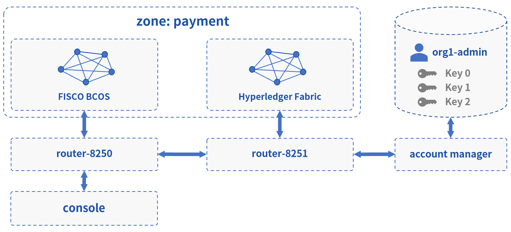

# 区块链接入与账户配置

完成WeCross基础组件的部署后，接下来就是接入区块链，配置跨链账户，构建一个真实的跨链网络！

## 接入区块链

- **接入FISCO BCOS**：接入至跨链路由`router-8250`，[详细教程](../../stubs/bcos.html)
- **接入Hyperledger Fabric**：接入至跨链路由`router-8251`，[详细教程](../../stubs/fabric.html)


完成区块链接入后，重启跨链路由加载已配置的跨链资源。

```bash
# 重启 router-8250
cd ~/wecross-networks/routers-payment/127.0.0.1-8250-25500/
bash stop.sh && bash start.sh 

# 重启 router-8251
cd ~/wecross-networks/routers-payment/127.0.0.1-8251-25501/
bash stop.sh && bash start.sh 
```

检查日志，可看到刷出已加载的跨链资源，`ctrl + c` 退出。

``` bash
tail -f logs/info.log |grep "active resources"

2020-12-05 21:07:30.925 [Thread-3] INFO  WeCrossHost() - Current active resources: payment.bcos.WeCrossProxy(local), payment.bcos.WeCrossHub(local)
2020-12-05 21:07:40.940 [Thread-3] INFO  WeCrossHost() - Current active resources: payment.bcos.WeCrossProxy(local), payment.bcos.WeCrossHub(local)
2020-12-05 21:07:50.956 [Thread-3] INFO  WeCrossHost() - Current active resources: payment.bcos.WeCrossProxy(local), payment.bcos.WeCrossHub(local)
```

## 配置跨链账户

区块链接入后，必须配置相应的账户才能完成资源的调用。

WeCross将各种类型的链账户进行了汇总，统一用跨链账户进行管理。在WeCross中，用户以跨链账户身份进行登陆，再操作各种资源。要往特定类型的链上发交易，只需要在跨链账户中添加相应类型的链账户即可。

### 添加BCOS链账户

- 生成公私钥

在控制台的目录中生成FISCO BCOS的账户公私钥，为添加链账户做准备。

``` bash
cd ~/wecross-networks/WeCross-Console/conf/accounts/
bash get_account.sh # 生成accounts目录
```

生成成功，输出账户地址（address），请记录，用于后续添加链账户。

``` 
[INFO] Account Address: 0x129f336960ae6632ac3de903619720dde916d922
```

- 启动控制台

``` bash
cd ~/wecross-networks/WeCross-Console/
bash start.sh
```

- 登录

用默认的跨链账户登录：org1-admin，密码：123456（默认账户在WeCross-Account-Manager/conf/application.toml配置）。

``` bash
[WeCross]> login org1-admin 123456
Result: success
=============================================================================================
Universal Account:
username: org1-admin
pubKey  : 3059301306...
uaID    : 3059301306...
```

- 添加链账户

为当前登录的跨链账户添加用于发交易的链账户，示例如下（每次生成的账户地址有所不同，需按具体情况填入）。

``` bash
# 参数： addChainAccount BCOS2.0 公钥位置 私钥位置 账户地址(address) 是否设置为发交易的默认链账户
[WeCross.org1-admin]> addChainAccount BCOS2.0 conf/accounts/accounts/0x4e89af80184147fcddc391c64ad673512236af67.public.pem conf/accounts/accounts/0x4e89af80184147fcddc391c64ad673512236af67.pem 0x4e89af80184147fcddc391c64ad673512236af67 true
```

添加成功，退出控制台。

``` bash
[WeCross.org1-admin]> quit
```

### 添加Fabric链账户

**注意：** 在添加Fabric链账户之前，请确保已搭建Fabric链，请参考[搭建Fabric区块链](../../stubs/fabric.html#id1)

- 拷贝公私钥

将fabric链的公私钥拷贝至控制台目录，为添加链账户做准备。

``` bash
cp -r ~/wecross-networks/fabric/certs/accounts/* ~/wecross-networks/WeCross-Console/conf/accounts/
```

- 启动控制台

``` bash
cd ~/wecross-networks/WeCross-Console/
bash start.sh
```

- 登录

用默认的跨链账户登录：org1-admin，密码：123456（默认账户在WeCross-Account-Manager/conf/application.toml配置）。

``` bash
[WeCross]> login org1-admin 123456
Result: success
=============================================================================================
Universal Account:
username: org1-admin
pubKey  : 3059301306...
uaID    : 3059301306...
```

- 添加链账户

为当前登录的跨链账户添加用于发交易的链账户。

``` bash
# 参数： addChainAccount Fabric1.4 私钥位置 公钥位置 MSPID 是否设置为发交易的默认链账户

# 添加 fabric_admin_org1
[WeCross.org1-admin]> addChainAccount Fabric1.4 conf/accounts/fabric_admin_org1/account.crt conf/accounts/fabric_admin_org1/account.key Org1MSP true 

# 添加 fabric_admin_org2
[WeCross.org1-admin]> addChainAccount Fabric1.4 conf/accounts/fabric_admin_org2/account.crt conf/accounts/fabric_admin_org2/account.key Org2MSP true
```

### 查看链账户

查看当前登录的跨链账户下的所有链账户，`isDefault`为`true`表示发交易的默认账户。

``` bash
[WeCross.org1-admin]> listAccount
Universal Account:
username: org1-admin
pubKey  : 3059301306...
uaID    : 3059301306...
chainAccounts: [
        BCOS2.0 Account:
        keyID    : 0
        type     : BCOS2.0
        address  : 0x4e89af80184147fcddc391c64ad673512236af67
        isDefault: true
        ----------
        Fabric1.4 Account:
        keyID    : 2
        type     : Fabric1.4
        MembershipID : Org2MSP
        isDefault: true
        ----------
        Fabric1.4 Account:
        keyID    : 1
        type     : Fabric1.4
        MembershipID : Org1MSP
        isDefault: false
        ----------
]
```

操作成功，退出控制台。

``` bash
[WeCross.org1-admin]> quit
```
