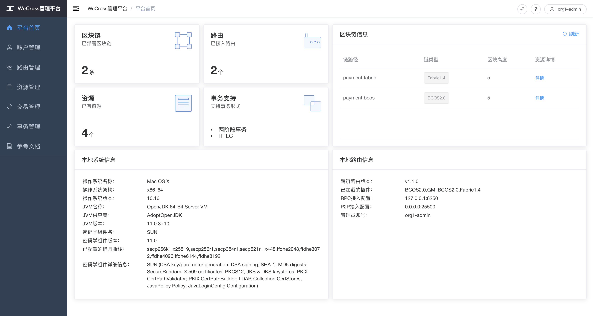

# 手动组网

本文档介绍以手动的方式，一步步搭建一个与[Demo](./demo/demo.md)相同的跨链网络。


## 快速部署

本章指导完成[**跨链路由**](../introduction/introduction.html#id2)的部署。

* **账户服务（account manager）**：为跨链系统提供账户管理
* **跨链路由（router）**：与区块链节点对接，并彼此互连，形成[跨链分区](../introduction/introduction.html#id2)，负责跨链请求的转发
* **跨链控制台（console）**：查询和发送交易的操作终端


操作以`~/wecross/`目录下为例进行。若Demo未清理，请先[清理Demo环境](./demo/demo.html#demo)。

``` bash
mkdir -p ~/wecross/ && cd ~/wecross/
```

### 部署 WeCross Router

下载WeCross，用WeCross中的工具生成跨链路由，并启动跨链路由。

#### 下载WeCross

WeCross中包含了生成跨链路由的工具，执行以下命令进行下载（提供[三种下载方式](../version/download.html#wecross)，可根据网络环境选择合适的方式进行下载），程序下载至当前目录`WeCross/`中。

```bash
bash <(curl -sL https://github.com/WeBankBlockchain/WeCross/releases/download/resources/download_wecross.sh)
```

#### 生成跨链路由

本例将构建两个跨链路由。首先创建一个`ipfile`配置文件，将需要构建的两个跨链路由信息（`ip:rpc_port:p2p_port`）按行分隔，保存到文件中。

**注**：请确保机器的`8250`，`8251`, `25500`，`25501`端口没有被占用。

```bash
cd ~/wecross
vim ipfile

# 在文件中键入以下内容
127.0.0.1:8250:25500
127.0.0.1:8251:25501
```

生成好`ipfile`文件后，使用脚本[build_wecross.sh](../manual/scripts.html#wecross)生成两个跨链路由。

```bash
# -f 表示以文件为输入
bash ./WeCross/build_wecross.sh -n payment -o routers-payment -f ipfile

# 成功输出如下信息
[INFO] Create routers-payment/127.0.0.1-8250-25500 successfully
[INFO] Create routers-payment/127.0.0.1-8251-25501 successfully
[INFO] All completed. WeCross routers are generated in: routers-payment/
```

```eval_rst
.. note::
    - -n 指定跨链分区标识符(zone id)，跨链分区通过zone id进行区分，可以理解为业务名称。
    - -o 指定输出的目录，并在该目录下生成一个跨链路由。
    - -f 指定需要生成的WeCross跨链路由的列表，包括ip地址，rpc端口，p2p端口，生成后的router已完成互联配置。
```

在routers-payment目录下生成了两个跨链路由。

``` bash
tree routers-payment/ -L 1
routers-payment/
├── 127.0.0.1-8251-25501
├── 127.0.0.1-8252-25502
└── cert
```

生成的跨链路由目录内容如下，以`127.0.0.1-8250-25500`为例。

```bash
# 已屏蔽lib和pages目录，该目录存放所有依赖的jar包
tree routers-payment/127.0.0.1-8250-25500/
routers-payment/127.0.0.1-8250-25500/
├── add_chain.sh      # 区块链配置文件创建脚本
├── apps
│   └── WeCross.jar   # WeCross路由jar包
├── build_wecross.sh
├── conf              # 配置文件目录
│   ├── accounts      # 账户配置目录
│   ├── application.properties 
│   ├── chains        # 区块链配置目录，要接入不同的链，在此目录下进行配置
│   ├── log4j2.xml    
│   ├── ca.crt        # 根证书
│   ├── ssl.crt       # 跨链路由证书
│   ├── ssl.key       # 跨链路由私钥
│   ├── node.nodeid   # 跨链路由nodeid
│   └── wecross.toml  # WeCross Router主配置文件
├── create_cert.sh    # 证书生成脚本
├── download_wecross.sh
├── pages             # 网页管理台页面文件
├── plugin            # 插件目录，接入相应类型链的插件
│   ├── bcos-stub-gm.jar
│   ├── bcos-stub.jar
│   └── fabric-stub.jar
├── start.sh          # 启动脚本
└── stop.sh           # 停止脚本
```

#### 部署账户服务

下载（执行时需输入相应数据库的配置）

``` bash
bash <(curl -sL https://github.com/WeBankBlockchain/WeCross/releases/download/resources/download_account_manager.sh)
```

拷贝证书

``` bash
cd ~/wecross/WeCross-Account-Manager/
cp ~/wecross/routers-payment/cert/sdk/* conf/
```

生成私钥

``` bash
bash create_rsa_keypair.sh -d conf/
```

配置

``` bash
cp conf/application-sample.toml conf/application.toml
vim conf/application.toml
```

需配置内容如下

* admin：配置admin账户，此处可默认，router中的admin账户需与此处对应，用于登录账户服务
* db：配置自己的数据库账号密码

``` toml
[service]
    address = '0.0.0.0'
    port = 8340
    sslKey = 'classpath:ssl.key'
    sslCert = 'classpath:ssl.crt'
    caCert = 'classpath:ca.crt'
    sslOn = true

[admin] 
    # admin账户配置，第一次启动时写入db，之后作为启动校验字段
    name = 'org1-admin' # admin账户名
    password = '123456' # 密码

[auth]
    # for issuring token
    name = 'org1'
    expires = 18000 # 5 h
    noActiveExpires = 600 # 10 min

[db]
    # for connect database
    url = 'jdbc:mysql://localhost:3306/wecross_account_manager'
    username = 'root' # 配置数据库账户
    password = '123456' # 配置数据库密码，不支接受空密码
[ext]
    # for image auth code, allow image auth token empty
    allowImageAuthCodeEmpty = true
```

启动

``` bash
bash start.sh
```

#### 启动跨链路由

```bash
# 启动 router-8250
cd ~/wecross/routers-payment/127.0.0.1-8250-25500/
bash start.sh   # 停止: bash stop.sh

# 启动 router-8251
cd ~/wecross/routers-payment/127.0.0.1-8251-25501/
bash start.sh   # 停止: bash stop.sh
```

启动成功，输出如下：

```
WeCross booting up .........
WeCross start successfully
```

如果启动失败，检查`8250, 25500`端口是否被占用。

``` bash
netstat -napl | grep 8250
netstat -napl | grep 25500
netstat -napl | grep 8251
netstat -napl | grep 25501
```

## 接入区块链

完成了WeCross的部署，如何让它和一条真实的区块链交互，相信优秀的你一定在跃跃欲试。

* 接入BCOS链：在跨链路由`router-8250`上接入，[详细教程](../stubs/bcos.html)
* 接入Fabric链：在跨链路由`router-8251`上接入，[详细教程](../stubs/fabric.html)


完成区块链接入后，启动跨链路由加载已配置的跨链资源。

```bash
# 若WeCross跨链路由未停止，需要先停止
bash stop.sh

# 重新启动
bash start.sh
```

检查日志，可看到刷出已加载的跨链资源，`ctrl + c` 退出。

``` bash
tail -f logs/info.log |grep "active resources"

2020-12-05 21:07:30.925 [Thread-3] INFO  WeCrossHost() - Current active resources: payment.bcos.WeCrossProxy(local), payment.bcos.WeCrossHub(local)
2020-12-05 21:07:40.940 [Thread-3] INFO  WeCrossHost() - Current active resources: payment.bcos.WeCrossProxy(local), payment.bcos.WeCrossHub(local)
2020-12-05 21:07:50.956 [Thread-3] INFO  WeCrossHost() - Current active resources: payment.bcos.WeCrossProxy(local), payment.bcos.WeCrossHub(local)
```

## 部署WeCross控制台

WeCross提供了控制台，方便用户进行跨链开发和调试。可通过脚本`build_console.sh`搭建控制台。

**下载WeCross控制台**

执行如下命令进行下载（提供[三种下载方式](../version/download.html#id2)，可根据网络环境选择合适的方式进行下载），下载完成后在当前目录下生成`WeCross-Console`目录。

```bash
cd ~/wecross/
bash <(curl -sL https://github.com/WeBankBlockchain/WeCross/releases/download/resources/download_console.sh)
```

**配置控制台**

```bash
cd ~/wecross/WeCross-Console
# 拷贝连接router所需的TLS证书，从生成的routers-payment/cert/sdk目录下拷贝
cp ~/wecross/routers-payment/cert/sdk/* conf/ # 包含：ca.crt、node.nodeid、ssl.crt、ssl.key
# 拷贝配置文件，并配置跨链路由RPC服务地址以及端口。此处采用默认配置，默认连接至本地8250端口。
cp conf/application-sample.toml conf/application.toml
```

```eval_rst
.. important::
    - 若搭建WeCross的IP和端口未使用默认配置，需自行更改WeCross-Console/conf/application.toml，详见 `控制台配置 <../manual/console.html#id12>`_。
```

**启动控制台**

```bash
bash start.sh
```

启动成功则输出如下信息，通过`help`可查看控制台帮助

```bash
=================================================================================
Welcome to WeCross console(v1.0.0)!
Type 'help' or 'h' for help. Type 'quit' or 'q' to quit console.
=================================================================================
```

**测试功能**

```bash
# 正常进入，可先退出控制台，等待后续配置
[WeCross]> quit
```

更多控制台命令及含义详见[控制台命令](../manual/console.html#id13)。

## 配置跨链账户

WeCross将各种类型的链账户进行了汇总，统一用跨链账户进行管理。在WeCross中，用户以跨链账户身份进行登陆，再操作各种资源。要往特定类型的链上发交易，只需要在跨链账户中添加相应类型的链账户即可。

**添加BCOS链账户**

* 生成公私钥

在控制台的目录中生成FISCO BCOS的账户公私钥，为添加链账户做准备

``` bash
cd ~/wecross/WeCross-Console/conf/accounts/
bash get_account.sh # 生成accounts目录
```

生成成功，输出账户地址（address），请记录，用于后续添加链账户

``` 
[INFO] Account Address   : 0x129f336960ae6632ac3de903619720dde916d922
```

* 启动控制台

``` bash
cd ~/wecross/WeCross-Console/
bash start.sh
```

* 登录

用默认的跨链账户登录：org1-admin，密码：123456。（默认账户在WeCross-Account-Manager/conf/application.toml配置）

``` bash
[WeCross]> login org1-admin 123456
Result: success
=============================================================================================
Universal Account:
username: org1-admin
pubKey  : 3059301306...
uaID    : 3059301306...
```

* 添加链账户

为当前登录的跨链账户添加用于发交易的链账户，举例如下（每次生成的账户地址有所不同，需按具体情况填入）

``` bash
# 参数： addChainAccount BCOS2.0 私钥位置 公钥位置 账户地址(address) 是否设置为发交易的默认链账户
[WeCross.org1-admin]> addChainAccount BCOS2.0 conf/accounts/accounts/0x4e89af80184147fcddc391c64ad673512236af67.public.pem conf/accounts/accounts/0x4e89af80184147fcddc391c64ad673512236af67.pem 0x4e89af80184147fcddc391c64ad673512236af67 true
```

添加成功，退出控制台

``` bash
[WeCross.org1-admin]> quit
```

**添加Fabric链账户**

* 拷贝公私钥

将fabric链的公私钥拷贝至控制台目录，为添加链账户做准备

``` bash
cp -r ~/wecross/fabric/certs/accounts/* ~/wecross/WeCross-Console/conf/accounts/
```

* 启动控制台

``` bash
cd ~/wecross/WeCross-Console/
bash start.sh
```

* 登录

用默认的跨链账户登录：org1-admin，密码：123456。（默认账户在WeCross-Account-Manager/conf/application.toml配置）

``` bash
[WeCross]> login org1-admin 123456
Result: success
=============================================================================================
Universal Account:
username: org1-admin
pubKey  : 3059301306...
uaID    : 3059301306...
```

* 添加链账户

为当前登录的跨链账户添加用于发交易的链账户。

``` bash
# 参数： addChainAccount Fabric1.4 私钥位置 公钥位置 MSPID 是否设置为发交易的默认链账户

# 添加 fabric_admin_org1
[WeCross.org1-admin]> addChainAccount Fabric1.4 conf/accounts/fabric_admin_org1/account.crt conf/accounts/fabric_admin_org1/account.key Org1MSP true 

# 添加 fabric_admin_org2
[WeCross.org1-admin]> addChainAccount Fabric1.4 conf/accounts/fabric_admin_org2/account.crt conf/accounts/fabric_admin_org2/account.key Org2MSP true
```

**查看链账户**

查看当前登录的跨链账户下的所有链账户，`isDefault`为`true`表示发交易的默认账户

``` bash
[WeCross.org1-admin]> listAccount
Universal Account:
username: org1-admin
pubKey  : 3059301306...
uaID    : 3059301306...
chainAccounts: [
        BCOS2.0 Account:
        keyID    : 0
        type     : BCOS2.0
        address  : 0x4e89af80184147fcddc391c64ad673512236af67
        isDefault: true
        ----------
        Fabric1.4 Account:
        keyID    : 2
        type     : Fabric1.4
        MembershipID : Org2MSP
        isDefault: true
        ----------
        Fabric1.4 Account:
        keyID    : 1
        type     : Fabric1.4
        MembershipID : Org1MSP
        isDefault: false
        ----------
]
```

操作成功，退出控制台

``` bash
[WeCross.org1-admin]> quit
```

## 部署跨链资源

WeCross支持直接通过WeCross-Console部署跨链资源。

``` bash
cd ~/wecross/WeCross-Console/
```

### 部署 BCOS 跨链资源

WeCross 支持通过 WeCross-Console 向指定的BCOS链上部署合约。部署步骤如下。

**配置合约代码**

* 以HelloWorld合约为例
* WeCross-Console 的合约存放目录：`conf/contracts/solidity/`

目录下已有HelloWorld合约文件，若需部署其它合约，可将合约拷贝至相同位置。

``` bash
tree conf/contracts/solidity/
conf/contracts/solidity/
└── HelloWorld.sol
```

**启动控制台**

``` bash 
cd ~/wecross/WeCross-Console/
bash start.sh
```

**部署合约**

用`bcosDeploy`命令进行部署。

> 参数：ipath，代码目录，合约名，设置一个版本号

``` bash
# 登录
[WeCross]> login org1-admin 123456

# 部署
[WeCross.org1-admin]> bcosDeploy payment.bcos.HelloWorld contracts/solidity/HelloWorld.sol HelloWorld 1.0
Result: 0x953c8f97f9ea5930e6ca8d5eabbd9dfdcb142e6c
```

用`listResources`可查看此资源（`payment.bcos.HelloWorld`）已部署

``` bash
[WeCross.org1-admin]> listResources
path: payment.bcos.HelloWorld, type: BCOS2.0, distance: 0
path: payment.bcos.WeCrossHub, type: BCOS2.0, distance: 0
path: payment.fabric.WeCrossHub, type: Fabric1.4, distance: 1
total: 3
```

### 部署 Fabric 跨链资源

WeCross 支持通过 WeCross-Console 向指定的Fabric链上部署chaincode。

**配置chaincode代码（部署sacc为例）**

* WeCross-Console的chaincode存放目录：`conf/contracts/chaincode/`
* sacc代码放入目录：`conf/contracts/chaincode/sacc`（目录名sacc为chaincode的名字）
* sacc目录中放置chaincode代码：sacc.go （代码名任意）

 WeCross-Console中已默认存放了sacc，目录结构如下。

``` log
conf/contracts/chaincode/sacc
├── policy.yaml
└── sacc.go
```

**部署chaincode**

为不同的Org分别安装（install）相同的chaincode

``` bash
# 在登录态下，查看默认链账户，可看到Fabric1.4的默认账户是Org2MSP的
[WeCross.org1-admin]> listAccount
Universal Account:
username: org1-admin
pubKey  : 3059301306...
uaID    : 3059301306...
chainAccounts: [
        BCOS2.0 Account:
        keyID    : 0
        type     : BCOS2.0
        address  : 0x4e89af80184147fcddc391c64ad673512236af67
        isDefault: true
        ----------
        Fabric1.4 Account:
        keyID    : 2
        type     : Fabric1.4
        MembershipID : Org2MSP
        isDefault: true
        ----------
        Fabric1.4 Account:
        keyID    : 1
        type     : Fabric1.4
        MembershipID : Org1MSP
        isDefault: false
        ----------
]

# 在向Org1进行install前，设置Fabric1.4的默认账户为Org1MSP，参数：setDefaultAccount Fabric1.4 keyID
[WeCross.org1-admin]> setDefaultAccount Fabric1.4 1

# 给Org1安装sacc，参数：path Org 链码位置 版本号 链码语言
[WeCross.org1-admin]> fabricInstall payment.fabric.sacc Org1 contracts/chaincode/sacc 1.0 GO_LANG
path: classpath:contracts/chaincode/sacc
Result: Success

# 在向Org2进行install前，设置Fabric1.4的默认账户为Org2MSP，参数：setDefaultAccount Fabric1.4 keyID
[WeCross.org1-admin]> setDefaultAccount Fabric1.4 2

# 给Org2安装sacc，参数：path Org 链码位置 版本号 链码语言
[WeCross.org1-admin]> fabricInstall payment.fabric.sacc Org2 contracts/chaincode/sacc 1.0 GO_LANG
path: classpath:contracts/chaincode/sacc
Result: Success
```

实例化（instantiate）指定chaincode

> 参数：ipath，对应的几个Org，chaincode代码工程目录，指定的版本，chaincode语言，背书策略（此处用默认），初始化参数

``` bash
[WeCross.org1-admin]> fabricInstantiate payment.fabric.sacc ["Org1","Org2"] contracts/chaincode/sacc 1.0 GO_LANG default ["a","10"] # fabricInstantiate 时默认Org1MSP或Org2MSP的链账户都可，此处用的Org2MSP
Result: Instantiating... Please wait and use 'listResources' to check. See router's log for more information.
```

instantiate请求后，需等待1分钟左右。用`listResources`查看是否成功。若instantiate成功，可查询到资源`payment.fabric.sacc`。

``` bash
[WeCross.org1-admin]> listResources
path: payment.bcos.HelloWorld, type: BCOS2.0, distance: 0
path: payment.fabric.WeCrossHub, type: Fabric1.4, distance: 1
path: payment.bcos.WeCrossHub, type: BCOS2.0, distance: 0
path: payment.fabric.sacc, type: Fabric1.4, distance: 1
total: 4

[WeCross.org1-admin]> quit # 退出控制台
```

## 操作跨链资源

**登录**

用默认的跨链账户登录：org1-admin，密码：123456。（默认账户在WeCross-Account-Manager/conf/application.toml配置）

``` bash
[WeCross]> login org1-admin 123456
Result: success
=============================================================================================
Universal Account:
username: org1-admin
pubKey  : 3059301306...
uaID    : 3059301306...
```

**查看资源**

用`listResources`命令查看WeCross跨链网络中的所有资源。可看到有多个资源：

* `payment.bcos.HelloWorld`
  * 对应于FISCO BCOS链上的HelloWorld.sol合约
* `payment.fabric.sacc`
  * 对应于Fabric链上的[sacc.go](https://github.com/hyperledger/fabric-samples/blob/v1.4.4/chaincode/sacc/sacc.go)合约
* `payment.xxxx.WeCrossHub`
  * 每条链默认安装的Hub合约，用于接收链上合约发起的跨链调用。可参考[《合约跨链》](../../dev/interchain.html)

```bash
[WeCross.org1-admin]> listResources
path: payment.bcos.HelloWorld, type: BCOS2.0, distance: 0
path: payment.fabric.WeCrossHub, type: Fabric1.4, distance: 1
path: payment.bcos.WeCrossHub, type: BCOS2.0, distance: 0
path: payment.fabric.sacc, type: Fabric1.4, distance: 1
total: 4
```

**查看账户**

用`listAccount`命令查看当前登录的跨链账户中已经配置的链账户

```bash
chainAccounts: [
        BCOS2.0 Account:
        keyID    : 0
        type     : BCOS2.0
        address  : 0xe011a210f24f1078a423458cb53ee49fc5feb342
        isDefault: true
        ----------
        Fabric1.4 Account:
        keyID    : 2
        type     : Fabric1.4
        MembershipID : Org2MSP
        isDefault: true
        ----------
        Fabric1.4 Account:
        keyID    : 1
        type     : Fabric1.4
        MembershipID : Org1MSP
        isDefault: false
        ----------
]
```

**操作资源：payment.bcos.HelloWorld**

- 读资源
  - 命令：`call path 接口名 [参数列表]`
  - 示例：`call payment.bcos.HelloWorld get`

```bash
# 调用HelloWorld合约中的get接口
[WeCross.org1-admin]> call payment.bcos.HelloWorld get
Result: [Hello, World!]
```

- 写资源
  - 命令：`sendTransaction path 接口名 [参数列表]`
  - 示例：`sendTransaction payment.bcos.HelloWeCross set Tom`

```bash
# 调用HelloWeCross合约中的set接口
[WeCross.org1-admin]> sendTransaction payment.bcos.HelloWorld set Tom
Txhash  : 0xd9cefb8c3ba28084583ba340e1d73a37574e1661926c3116729b1ec029f59828
BlockNum: 6
Result  : []     // 将Tom给set进去

[WeCross.org1-admin]> call payment.bcos.HelloWorld get
Result: [Tom]    // 再次get，Tom已set
```

**操作资源：payment.fabric.sacc**

跨链资源是对各个不同链上资源的统一和抽象，因此操作的命令是保持一致的。

- 读资源

```bash
# 调用mycc合约中的query接口
[WeCross.org1-admin]> call payment.fabric.sacc get a
Result: [10] // 初次get，a的值为10
```

- 写资源

```bash
# 调用sacc合约中的set接口
[WeCross.org1-admin]> sendTransaction payment.fabric.sacc set a 666
Txhash  : aa3a7cd62d4b4c56b486f11fae2d903b7f07c2a3fa315ee2b44d5f5c43f5a8dc
BlockNum: 8
Result  : [666]

[WeCross.org1-admin]> call payment.fabric.sacc get a
Result: [666] // 再次get，a的值变成666

# 退出WeCross控制台
[WeCross.org1-admin]> quit # 若想再次启动控制台，cd至WeCross-Console，执行start.sh即可
```

## 访问网页管理台

浏览器访问`router-8250`的网页管理台

``` url
http://localhost:8250/s/index.html#/login
```

用demo已配置账户进行登录：`org1-admin`，密码：`123456`



管理台中包含如下内容，点击链接进入相关操作指导。

* [登录/注册](../manual/webApp.html#id10)
* [平台首页](../manual/webApp.html#id11)
* [账户管理](../manual/webApp.html#id12)
* [路由管理](../manual/webApp.html#id13)
* [资源管理](../manual/webApp.html#id14)
* [交易管理](../manual/webApp.html#id15)
* [事务管理](../manual/webApp.html#id16)

``` eval_rst
.. note::
    - 若需要远程访问，请在router的conf/wecross.toml中，修改[rpc]标签下的address为所需ip（如：0.0.0.0）。保存后，重启router即可。
```

恭喜，你已经完成了整个WeCross网络的体验。相信优秀的你已经对WeCross有了大致的了解。接下来，你可以基于WeCross Java SDK开发更多的跨链应用，通过统一的接口对各种链上的资源进行操作。
