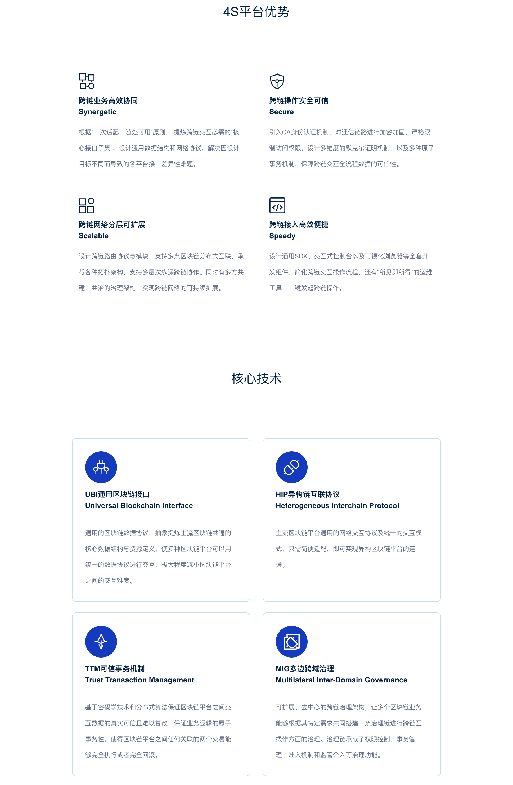

.. image:: _static/images/menu_logo_wecross.svg

##############################################################
WeCross
##############################################################

由微众银行自主研发并完全开源的分布式商业区块链跨链协作平台。该平台能解决业界主流的区块链产品间接口不互通、无法协作的问题，以及区块链系统无法平行扩展、计算能力和存储容量存在瓶颈等问题。WeCross作为未来分布式商业区块链互联的基础架构，秉承公众联盟链多方参与、共享资源、智能协同和价值整合的理念，致力于促进跨行业、机构和地域的跨区块链价值交换和商业合作，实现了高效、通用和安全的区块链跨链协作机制。

.. toctree::
   :maxdepth: 1
   :caption: 平台介绍

   docs/introduction/introduction.md
   docs/version/index.rst

.. toctree::
   :maxdepth: 1
   :caption: 教程

   docs/tutorial/env.md
   docs/tutorial/demo/index.md
   docs/tutorial/networks.md

.. toctree::
   :maxdepth: 1
   :caption: 跨链操作

   docs/stubs/index.rst
   docs/routine/index.rst

.. toctree::
   :maxdepth: 1
   :caption: 操作手册

   docs/manual/webApp.md
   docs/manual/console.md
   docs/manual/account.md
   docs/manual/scripts.md
   docs/manual/config.md

.. toctree::
   :maxdepth: 1
   :caption: 开发手册

   docs/dev/sdk.rst
   docs/dev/interchain.md
   docs/dev/stub.md
   docs/dev/rpc.md

.. toctree::
   :maxdepth: 1
   :caption: 参考

   docs/scenarios/index.rst
   docs/faq/faq.md
   docs/community/index.rst

